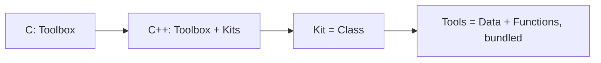

[🏠 C++ Course Home](./README.md) &nbsp;|&nbsp; Next ➡ [02. Variables, References & I/O](./02-Variables-References-and-IO.md)

---

# 📘 1. Introduction to C++

| | |
|---|---|
| **Difficulty** | 🟢 Beginner |
| **Estimated Reading Time** | ~15 minutes |
| **Prerequisites** | None - basic C knowledge helps but isn't required |

**Progress**
```
██░░░░░░░░░░░░░░░░░░░░░░░░  Lesson 1 of 15
```

---

## 🌟 Why Learn This?

C gets code close to the machine. C++ takes that same closeness and adds a second gear: the ability to organize huge, messy real-world programs into clean, reusable pieces.

- **Origin:** C++ was created by Bjarne Stroustrup in 1979 at Bell Labs - originally called "C with Classes."
- **Why it mattered:** C is great for small, tight programs. But once a codebase grows to millions of lines, raw C becomes a maintenance nightmare. C++ kept C's speed and added tools for managing complexity.

**C++ is quietly running enormous parts of the world:**

- **Chrome, Firefox, and most browser engines** are written in C++.
- **Windows, macOS, and parts of Linux** rely on C++ for core components.
- **Game engines** - Unreal Engine, most AAA game studios - are built in C++ for raw performance.
- **Trading systems, databases (MySQL, MongoDB core), and Adobe's entire product line** run on C++.

C++ doesn't replace C - it's a superset. Almost every C program is valid C++. What C++ adds is the ability to model real-world things as **objects**, which is the single biggest shift you're about to make as a programmer.

---

## 🎯 By the End of This Lesson

You should know

✔ Exactly what C++ adds on top of C, and why

✔ The skeleton of a C++ program, and how it differs from C's

✔ Why `cin`/`cout` replace `scanf`/`printf` - and when to still use the old ones

✔ What `namespace std` actually means, and why skipping `std::` can bite you

✔ How a C++ compiler turns your code into a runnable program

✔ The difference between compile-time and run-time, and why it matters for debugging

---

## 📚 Table of Contents

- [Before We Start](#-before-we-start)
- [Imagine This...](#-imagine-this)
- [Core Concepts](#-core-concepts)
- [Behind the Scenes](#-behind-the-scenes)
- [Visual Explanation](#-visual-explanation)
- [Code Example](#-code-example)
- [Predict the Output](#-predict-the-output)
- [Try It Yourself](#-try-it-yourself)
- [Mini Challenge](#-mini-challenge)
- [Real World Applications](#-real-world-applications)
- [Memory Tricks](#-memory-tricks)
- [Fun Fact](#-fun-fact)
- [Common Mistakes](#-common-mistakes)
- [Beginner Traps](#-beginner-traps)
- [Exam Tips](#-exam-tips)
- [Interview Questions](#-interview-questions)
- [Quiz](#-quiz)
- [Summary](#-summary)
- [What's Next?](#-whats-next)
- [References](#-references)

---

## 🧠 Before We Start

You don't need to have finished a C course to start this one, but if you have, you're ahead. You should have:

- A C++ compiler (GCC's `g++`, or Clang) installed, **or** an online compiler like [Compiler Explorer](https://godbolt.org) or [Replit](https://replit.com).
- A text editor (VS Code is a great free choice).
- Comfort with the idea that a program is a sequence of instructions - if `printf("Hello");` looks familiar, you're ready.

---

## 💡 Imagine This...

Imagine C is a **toolbox** - a hammer, a saw, a drill, all separate, all in your hands, all your responsibility to use correctly and put away.

C++ is that same toolbox, except now the tools can be **grouped into kits**. A "car repair kit" isn't just tools thrown in a bag - it's tools *plus* the knowledge of how they work together, labeled and organized, ready to hand to someone else who instantly understands what it's for.

That's what a **class** is in C++: a bundle of data and the functions that operate on it, packaged as one reusable unit. You're not just writing instructions anymore - you're designing blueprints for *things*.

Keep that toolkit-vs-kit picture in mind. Every OOP concept later in this course is really just a more precise version of "organize the tools into a labeled kit."

---

## 📖 Core Concepts

**C++** is a general-purpose, compiled programming language that extends C with support for **object-oriented programming (OOP)**, while still allowing you to write plain procedural C-style code when that's simpler.

### What C++ Adds on Top of C

| Feature | C | C++ |
|---|---|---|
| Paradigm | Procedural only | Procedural **and** object-oriented |
| I/O | `printf`/`scanf` | `cout`/`cin` (plus `printf`/`scanf` still work) |
| Memory | `malloc`/`free` | `new`/`delete` (plus `malloc`/`free` still work) |
| Data bundling | `struct` (data only) | `class`/`struct` (data **and** functions together) |
| Function reuse | One function, one signature | Function **overloading** - same name, different parameters |
| Standard library | Small (`stdio.h`, `stdlib.h`, ...) | Massive - the STL (containers, algorithms, iterators) |

C++ is often called a **superset of C**: almost any valid C program compiles as C++ with little to no change.

### The Skeleton of a C++ Program

```cpp
#include <iostream>     // header for cin/cout, C++'s I/O library

int main() {
    std::cout << "Hello, World!" << std::endl;
    return 0;
}
```

Compare that to C's version - same shape, different vocabulary:

| Piece | C | C++ |
|---|---|---|
| Header | `#include <stdio.h>` | `#include <iostream>` |
| Output | `printf("Hello");` | `std::cout << "Hello";` |
| Input | `scanf("%d", &x);` | `std::cin >> x;` |

### The `std::` Prefix and Namespaces

Everything in C++'s standard library - `cout`, `cin`, `vector`, `string` - lives inside a **namespace** called `std`, short for "standard." A namespace is just a labeled container that stops names from colliding when big projects combine code from many sources.

```cpp
std::cout << "Hi";     // fully qualified - always works, always clear

using namespace std;   // imports every name from std - convenient, but risky
cout << "Hi";           // works now, but can silently collide with your own names
```

> **Rule of thumb:** `std::` everywhere is verbose but safe. `using namespace std;` is common in small student programs and textbooks, but professional codebases avoid it - it's one of the first habits to unlearn as you grow.

---

## 🔍 Behind the Scenes

A C++ compiler does more work than a C compiler, because C++ source code carries more meaning:

```
your_code.cpp
   │  Preprocessing (expands #include, macros)
   ▼
Preprocessed code
   │  Compilation (C++ → Assembly) - includes template instantiation,
   │  operator overload resolution, and name mangling
   ▼
Assembly code
   │  Assembling (Assembly → machine code, produces an object file)
   ▼
object_file.o
   │  Linking (connects your code to library code, resolves mangled names)
   ▼
executable
```

**Name mangling** is unique to C++:

- Functions can be overloaded (same name, different parameters).
- So the compiler encodes each function's parameter types into its internal name.
- That's how the linker tells `add(int, int)` apart from `add(double, double)`.
- C doesn't need this, because C never allows two functions to share a name.

---

## 🖥 Visual Explanation



Every lesson from here on builds on that one shift: from loose tools to organized kits.

---

## 💻 Code Example

```cpp
#include <iostream>

int main() {
    std::cout << "Hello, OpenStudyNotes!" << std::endl;
    std::cout << "Welcome to C++." << std::endl;
    return 0;
}
```

**Expected Output:**
```
Hello, OpenStudyNotes!
Welcome to C++.
```

**Step-by-step execution:**
1. `#include <iostream>` pulls in the declarations for `cout`, `cin`, and `endl`.
2. `main()` begins execution - the entry point, exactly like in C.
3. `std::cout << "..."` sends text to the screen; `<<` is the "insertion" operator, pointing data *into* the output stream.
4. `std::endl` flushes the output buffer and moves to a new line.
5. `return 0;` reports success to the operating system.

**Why it works:** `cout` isn't a function you call with parentheses - it's a stream object, and `<<` chains data into it. That's a fundamentally different mental model from `printf`'s format-string approach, and it's the first taste of operator overloading you'll formally learn in Lesson 7.

---

## 🎮 Predict the Output

```cpp
#include <iostream>
using namespace std;

int main() {
    cout << "A" << "B" << "C" << endl;
    cout << 1 << 2 << 3;
    return 0;
}
```

<details>
<summary>💡 Reveal the answer</summary>

```
ABC
123
```

Chained `<<` operators just keep feeding values into the same stream, left to right - strings and numbers alike, no format specifiers needed.
</details>

---

## 🧪 Try It Yourself

Modify the code example above to:
1. Print your name and university on two separate lines using `endl`.
2. Print three numbers on the same line, separated by spaces, using a single `cout` statement.
3. Remove `#include <iostream>` on purpose, compile it, and read the exact error your compiler gives you.

---

## 🎯 Mini Challenge

Write a C++ program that prints your name inside a box, using only `cout` statements - no loops or variables required yet:

```
*******************
* Sisuru Samarathunga *
*******************
```

<details>
<summary>💡 Need a hint?</summary>

Count the asterisks so the top and bottom borders match the width of the middle line, including the spaces around your name.
</details>

---

## 🌍 Real World Applications

| Concept | Where it shows up |
|---|---|
| `iostream`/streams | Logging libraries in almost every C++ backend service |
| Namespaces | Large codebases like LLVM and Chromium, where thousands of files must avoid name collisions |
| C++ as a C superset | Game engines mixing performance-critical C-style code with C++ object systems |

---

## 🧠 Memory Tricks

- **`<<` points data INTO the stream (output). `>>` points data OUT of the stream and INTO your variable (input).**
- **`std::` = "which toolbox drawer this came from." Skipping it is fine until two drawers have a tool with the same name.**

---

## 🎉 Fun Fact

C++ was originally named **"C with Classes"** before being renamed in 1983. The name "C++" is itself a programmer's joke: `++` is C's increment operator, so "C++" literally means "one step beyond C."

---

## ⚠ Common Mistakes

```cpp
// ❌ Wrong - missing <iostream>, cout is undefined
int main() {
    std::cout << "Hello";
}

// ✅ Correct
#include <iostream>
int main() {
    std::cout << "Hello";
}
```
*Why:*
- `cout` isn't a language keyword - it's declared inside `<iostream>`.
- Without the header, the compiler has no idea what `cout` means, even though the syntax looks correct.

---

## 🚫 Beginner Traps

- **"`using namespace std;` is always fine."** It's fine for small student exercises, but in larger programs it can cause silent name collisions between your code and the standard library - most style guides discourage it in real projects.
- **"C++ replaces C entirely."** False - C++ is a superset. Plenty of production C++ code still uses `printf`, `malloc`, and C-style arrays where they're simpler or faster.

---

## 📌 Exam Tips

- Know the C vs C++ header/I/O mapping cold: `stdio.h` ↔ `iostream`, `printf`/`scanf` ↔ `cout`/`cin`.
- Be ready to explain **why** `std::` exists (namespaces prevent name collisions) - a very common short-answer question.
- "C++ is a superset of C" is a frequently tested one-liner - know it exactly.

---

## 🎤 Interview Questions

**Q: Is C++ a superset of C?**
- Almost entirely - most valid C code compiles as C++ with little or no modification.
- A few edge cases differ (e.g. C++ is stricter about implicit type conversions), but for practical purposes, yes.

**Q: What is `namespace std` and why does C++ use it?**
- `std` is the namespace containing the entire C++ Standard Library (`cout`, `cin`, `vector`, `string`, and more).
- Namespaces prevent naming collisions when combining code from multiple libraries or authors.

---

## ❓ Quiz

**Multiple Choice**

1. Which header is required for `cout` and `cin`? <br>
   A) `<stdio.h>`  
   B) `<iostream>`  
   C) `<stdlib.h>`  
   D) `<string.h>`

2. What does the `<<` operator do when used with `cout`? <br>
   A) Compares two values  
   B) Shifts bits left  
   C) Inserts data into the output stream  
   D) Declares a variable

3. What is `std` in C++? <br>
   A) A keyword  
   B) A namespace containing the standard library  
   C) A data type  
   D) A compiler flag

4. C++ is best described as: <br>
   A) A completely different language from C  
   B) A superset of C with added OOP support  
   C) A scripting language  
   D) A version of Java

5. What does name mangling solve? <br>
   A) Memory leaks  
   B) Letting overloaded functions have unique internal names  
   C) Formatting output  
   D) Compiling faster

<details><summary>✅ Reveal Answers</summary>

1. B  2. C  3. B  4. B  5. B
</details>

**True / False**

1. `using namespace std;` is required for every C++ program to compile.
2. C++ supports function overloading, but C does not.
3. Almost every valid C program is also valid C++.

<details><summary>✅ Reveal Answers</summary>

1. False (you can always use `std::` explicitly instead)  2. True  3. True
</details>

**Short Answer**

1. Why might a professional C++ codebase avoid `using namespace std;`?

<details><summary>✅ Reveal Guidance</summary>

- Importing every name from `std` increases the risk that a name in your own code (or another library) will silently collide with a standard library name.
- That collision causes confusing bugs or ambiguous function calls - especially as a codebase grows.
</details>

---

## 📝 Summary

You now know what C++ adds on top of C - object-oriented programming, streams instead of format strings, namespaces, and a much larger standard library - while still being able to write plain C-style code when it's simpler. You've seen the skeleton of a C++ program, how it compiles differently from C (name mangling), and why `std::` matters. This is the foundation the rest of the course - starting with references and I/O - builds directly on top of.

---

## 🚀 What's Next?

In the next lesson, you'll dig into **variables, references, and I/O** - including C++'s reference type, a safer alternative to pointers that you'll use constantly for the rest of this course.

---

## 📚 References

- Stroustrup, B. - *The C++ Programming Language* (4th Edition), Addison-Wesley.
- ISO/IEC 14882 - the official C++ Language Standard.

---

[🏠 C++ Course Home](./README.md) &nbsp;|&nbsp; Next ➡ [02. Variables, References & I/O](./02-Variables-References-and-IO.md)
