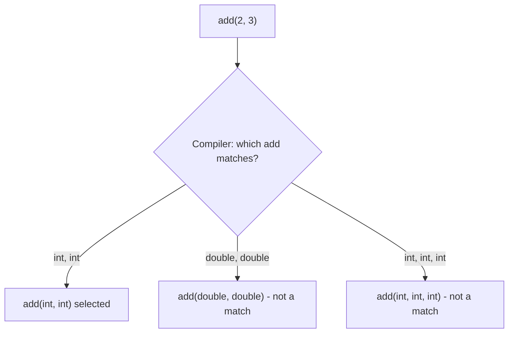

[⬅ Previous](./02-Variables-References-and-IO.md) &nbsp;|&nbsp; [🏠 C++ Course Home](./README.md) &nbsp;|&nbsp; Next ➡ [04. Pointers, Arrays & Dynamic Memory](./04-Pointers-Arrays-and-Dynamic-Memory.md)

---

# 📘 3. Functions & Overloading

| | |
|---|---|
| **Difficulty** | 🟢 Beginner |
| **Estimated Reading Time** | ~14 minutes |
| **Prerequisites** | [Lesson 2: Variables, References & I/O](./02-Variables-References-and-IO.md) |

**Progress**
```
██████░░░░░░░░░░░░░░░░░░░░  Lesson 3 of 15
```

---

## 🌟 Why Learn This?

In C, a function name is unique - one name, one signature, forever. C++ breaks that rule on purpose, letting you write several functions with the *same name* as long as their parameters differ. This single feature is what makes the rest of C++ - operator overloading, constructors, templates - possible.

- **Every C++ standard library function you'll use** (like `std::max`, `std::sqrt`) is overloaded to work with multiple types.
- Game engines and graphics libraries overload math functions (`add(Vector2, Vector2)`, `add(int, int)`) so the *same conceptual operation* reads naturally regardless of the data type.

---

## 🎯 By the End of This Lesson

You should know

✔ How function overloading works, and the rules the compiler uses to pick the right one

✔ How default arguments reduce the need for overloads

✔ What `inline` suggests to the compiler, and why it rarely matters today

✔ Pass-by-value vs. pass-by-reference vs. pass-by-`const` reference for function parameters

✔ Why overload resolution can become ambiguous - and how to read that error

---

## 📚 Table of Contents

- [Before We Start](#-before-we-start)
- [Imagine This...](#-imagine-this)
- [Core Concepts](#-core-concepts)
- [Behind the Scenes](#-behind-the-scenes)
- [Visual Explanation](#-visual-explanation)
- [Code Example](#-code-example)
- [Predict the Output](#-predict-the-output)
- [Try It Yourself](#-try-it-yourself)
- [Mini Challenge](#-mini-challenge)
- [Real World Applications](#-real-world-applications)
- [Memory Tricks](#-memory-tricks)
- [Fun Fact](#-fun-fact)
- [Common Mistakes](#-common-mistakes)
- [Beginner Traps](#-beginner-traps)
- [Exam Tips](#-exam-tips)
- [Interview Questions](#-interview-questions)
- [Quiz](#-quiz)
- [Summary](#-summary)
- [What's Next?](#-whats-next)
- [References](#-references)

---

## 🧠 Before We Start

You should be comfortable with:

- Declaring and calling functions (from C, or Lesson 2's examples).
- References from Lesson 2 - overloading uses them constantly.

---

## 💡 Imagine This...

Imagine the word "**cut**." You "cut" paper with scissors, "cut" wood with a saw, and "cut" a cake with a knife. It's the *same word*, but everyone instantly knows which tool and technique you mean, purely from context - what you're cutting.

That's function overloading. `area(int side)` for a square and `area(int length, int width)` for a rectangle are both named `area` - the compiler figures out which one you meant purely from what you handed it, just like a person figures out which "cut" you meant from what's in your hand.

---

## 📖 Core Concepts

### Function Overloading

Two or more functions can share a name if their **parameter lists differ** - in number, order, or type. Return type alone is *not* enough to distinguish them.

```cpp
int add(int a, int b) {
    return a + b;
}

double add(double a, double b) {
    return a + b;
}

int add(int a, int b, int c) {
    return a + b + c;
}
```

| Call | Which `add` runs? | Why |
|---|---|---|
| `add(2, 3)` | `add(int, int)` | Two int arguments match exactly |
| `add(2.5, 3.5)` | `add(double, double)` | Two double arguments match exactly |
| `add(1, 2, 3)` | `add(int, int, int)` | Three arguments only match this one |

### Default Arguments

A parameter can have a fallback value, letting one function cover cases that would otherwise need several overloads:

```cpp
void greet(std::string name, std::string greeting = "Hello") {
    std::cout << greeting << ", " << name << "!" << std::endl;
}

greet("Sisuru");              // "Hello, Sisuru!"
greet("Sisuru", "Welcome");    // "Welcome, Sisuru!"
```

> **Rule:** default arguments must come *last* in the parameter list - you can't have a defaulted parameter followed by a required one.

### Pass-by-Value vs. Reference vs. `const` Reference

| Style | Copies the argument? | Can modify caller's data? | Typical use |
|---|---|---|---|
| `void f(int x)` | Yes | No | Small, cheap types (`int`, `char`, `bool`) |
| `void f(int &x)` | No | Yes | You need to modify the caller's variable |
| `void f(const int &x)` | No | No | Large objects (`std::string`, `std::vector`) you only need to read |

`const &` is the C++ idiom for "give me read-only access without the cost of copying" - you'll see it constantly once you start passing objects instead of primitives.

### `inline` Functions

```cpp
inline int square(int x) {
    return x * x;
}
```

`inline` *suggests* the compiler paste the function's code directly at each call site, avoiding function-call overhead. Modern compilers are good enough at making this decision themselves that `inline` is rarely necessary today - but you'll still see it in older codebases and exam questions.

---

## 🔍 Behind the Scenes

When you call an overloaded function, the compiler performs **overload resolution** at compile time:

1. Look for an exact type match.
2. If none, look for a match via standard promotions (e.g. `int` → `double`).
3. If none, look for a match via user-defined conversions.
4. If more than one candidate is equally good, the compiler refuses to compile - an **ambiguous call** error.

Key takeaway:

- This entire process happens before your program ever runs.
- By the time you have an executable, exactly one function body is wired to each call site.
- There's no run-time cost to overloading at all.

---

## 🖥 Visual Explanation



---

## 💻 Code Example

```cpp
#include <iostream>

void printValue(int x) {
    std::cout << "int: " << x << std::endl;
}

void printValue(double x) {
    std::cout << "double: " << x << std::endl;
}

void printValue(std::string x) {
    std::cout << "string: " << x << std::endl;
}

int main() {
    printValue(10);
    printValue(3.14);
    printValue(std::string("hello"));
    return 0;
}
```

**Expected Output:**
```
int: 10
double: 3.14
string: hello
```

**Step-by-step execution:**
1. Three `printValue` functions exist, differing only in parameter type.
2. `printValue(10)` - `10` is an `int` literal, so the `int` version is selected.
3. `printValue(3.14)` - `3.14` is a `double` literal, so the `double` version is selected.
4. `printValue(std::string("hello"))` - matches the `std::string` version.

**Why it works:** the compiler decides *at compile time* which function each call refers to, purely based on argument types - there's no runtime "if" statement checking types anywhere.

---

## 🎮 Predict the Output

```cpp
#include <iostream>
using namespace std;

void show(int x, int y = 100) {
    cout << x << " " << y << endl;
}

int main() {
    show(5);
    show(5, 10);
    return 0;
}
```

<details>
<summary>💡 Reveal the answer</summary>

```
5 100
5 10
```

The first call omits `y`, so the default value `100` is used. The second call supplies both arguments, overriding the default.
</details>

---

## 🧪 Try It Yourself

Modify the code example above to:
1. Add a fourth overload, `printValue(char x)`.
2. Add a `printValue(int x, int y)` overload that prints both numbers, and call it.
3. Try writing two overloads that differ *only* in return type (same parameters) and read the compiler error - this confirms return type alone can't distinguish overloads.

---

## 🎯 Mini Challenge

Write an overloaded function `maxValue` that works for two `int`s, two `double`s, and three `int`s (three separate overloads), then call all three versions from `main`.

<details>
<summary>💡 Need a hint?</summary>

Each overload just needs an `if` comparing its parameters - the "overloading" part is purely about having three functions share the name `maxValue`.
</details>

---

## 🌍 Real World Applications

| Concept | Where it shows up |
|---|---|
| Overloading | `std::cout <<` itself is overloaded for `int`, `double`, `string`, and more - that's how one operator prints every type |
| Default arguments | GUI and game engine APIs, where most calls use sensible defaults but power users can override specific parameters |
| `const &` parameters | Nearly every function in performance-sensitive C++ that takes a `std::string` or `std::vector` |

---

## 🧠 Memory Tricks

- **Overloading = same name, different "shape" (parameters). Return type doesn't count as part of the shape.**
- **`const &` = "let me look, but don't make me copy, and don't let me touch."**

---

## 🎉 Fun Fact

`std::cout`'s `<<` operator is itself just an overloaded function in disguise - every type it can print (`int`, `double`, `std::string`, and any custom type you overload it for in Lesson 7) is a separate overload of `operator<<`.

---

## ⚠ Common Mistakes

```cpp
// ❌ Wrong - overloads differ ONLY by return type, won't compile
int getValue();
double getValue();

// ✅ Correct - differ by parameters instead
int getValue(int id);
double getValue(double id);
```
*Why:*
- The compiler resolves overloads by looking at the arguments you pass at the call site.
- It never looks at what you plan to do with the return value.
- So return type can't be the distinguishing feature.

---

## 🚫 Beginner Traps

- **"I can have as many default arguments in any position I want."** False - once a parameter has a default, every parameter after it must also have one.
- **"Overloading has a runtime performance cost, since the program has to check types."** False - overload resolution happens entirely at compile time; there's zero runtime overhead.

---

## 📌 Exam Tips

- Classic trick question: "Can two functions be overloaded if they only differ by return type?" - No.
- Know the default-argument ordering rule cold: defaults must be trailing parameters only.
- Be ready to trace which overload a specific call resolves to, given a set of overloaded signatures.

---

## 🎤 Interview Questions

**Q: What is function overloading, and what makes two overloads distinct?**
- Multiple functions sharing a name but differing in the number, order, or type of their parameters.
- Return type alone is never sufficient to distinguish overloads.

**Q: When would you pass a parameter as `const &` instead of by value?**
- When the argument is a large object (like a `std::string` or `std::vector`) that would be expensive to copy.
- `const &` avoids the copy while still preventing the function from modifying the caller's data.

---

## ❓ Quiz

**Multiple Choice**

1. What distinguishes two overloaded functions? <br>
   A) Return type only  
   B) Function body  
   C) Number, order, or type of parameters  
   D) The order they're written in the file

2. Where must default-valued parameters appear in the parameter list? <br>
   A) First  
   B) Anywhere  
   C) Last  
   D) They can't be mixed with required parameters at all

3. When does overload resolution happen? <br>
   A) At runtime  
   B) At compile time  
   C) Only when the program crashes  
   D) During linking only

4. What does `const &` as a parameter type prevent? <br>
   A) Copying the argument  
   B) Reading the argument  
   C) Passing the argument at all  
   D) Using the argument in expressions

5. Can these two coexist: `int f(int x)` and `double f(int x)`? <br>
   A) Yes  
   B) No - same parameters, different return type only  
   C) Yes, if declared in different files  
   D) Only with templates

<details><summary>✅ Reveal Answers</summary>

1. C  2. C  3. B  4. A  5. B
</details>

**True / False**

1. Overloaded functions must have the same number of parameters.
2. A defaulted parameter can be followed by a required (non-defaulted) parameter.
3. `const &` parameters avoid copying while preventing modification.

<details><summary>✅ Reveal Answers</summary>

1. False  2. False  3. True
</details>

**Short Answer**

1. Why is `const std::string &name` generally preferred over `std::string name` as a function parameter?

<details><summary>✅ Reveal Guidance</summary>

- Passing by value copies the entire string every time the function is called - wasteful for large strings.
- `const &` avoids that copy entirely.
- `const` still guarantees the function can't modify the caller's original string.
</details>

---

## 📝 Summary

You now know how function overloading lets multiple functions share a name based on their parameters, how default arguments reduce the need for near-duplicate overloads, and when to choose value, reference, or `const` reference parameters. Overloading is the foundation for operator overloading and constructors later in this course.

---

## 🚀 What's Next?

In the next lesson, you'll revisit **pointers and arrays** - this time alongside `new`/`delete` for dynamic memory, and `std::array` as a safer modern alternative.

---

## 📚 References

- Stroustrup, B. - *The C++ Programming Language* (4th Edition), Addison-Wesley.
- ISO/IEC 14882 - the official C++ Language Standard.

---

[⬅ Previous](./02-Variables-References-and-IO.md) &nbsp;|&nbsp; [🏠 C++ Course Home](./README.md) &nbsp;|&nbsp; Next ➡ [04. Pointers, Arrays & Dynamic Memory](./04-Pointers-Arrays-and-Dynamic-Memory.md)
