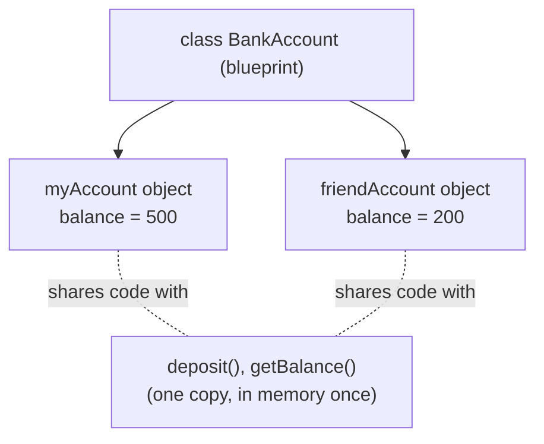

[⬅ Previous](./04-Pointers-Arrays-and-Dynamic-Memory.md) &nbsp;|&nbsp; [🏠 C++ Course Home](./README.md) &nbsp;|&nbsp; Next ➡ [06. Constructors & Destructors](./06-Constructors-and-Destructors.md)

---

# 📘 5. Introduction to OOP & Classes

| | |
|---|---|
| **Difficulty** | 🟡 Intermediate |
| **Estimated Reading Time** | ~16 minutes |
| **Prerequisites** | [Lesson 3: Functions & Overloading](./03-Functions-and-Overloading.md) |

**Progress**
```
██████████░░░░░░░░░░░░░░░░  Lesson 5 of 15
```

---

## 🌟 Why Learn This?

Everything before this lesson was procedural - data and the functions that act on it lived separately. **Object-oriented programming (OOP)** bundles them together into one unit: a **class**. This is the single biggest reason C++ can scale to millions of lines of code where plain C struggles.

- Virtually every major C++ codebase - game engines, GUI frameworks, database engines - is organized around classes.
- OOP concepts you learn here transfer almost directly to Java, Python, and C# - this is the most portable skill in this entire course.

---

## 🎯 By the End of This Lesson

You should know

✔ What a class and an object are, and how they relate

✔ The three access specifiers - `public`, `private`, `protected` - and what each protects

✔ What encapsulation means, and why it matters for large codebases

✔ How to define member variables and member functions

✔ The difference between a class's **interface** and its **implementation**

---

## 📚 Table of Contents

- [Before We Start](#-before-we-start)
- [Imagine This...](#-imagine-this)
- [Core Concepts](#-core-concepts)
- [Behind the Scenes](#-behind-the-scenes)
- [Visual Explanation](#-visual-explanation)
- [Code Example](#-code-example)
- [Predict the Output](#-predict-the-output)
- [Try It Yourself](#-try-it-yourself)
- [Mini Challenge](#-mini-challenge)
- [Real World Applications](#-real-world-applications)
- [Memory Tricks](#-memory-tricks)
- [Fun Fact](#-fun-fact)
- [Common Mistakes](#-common-mistakes)
- [Beginner Traps](#-beginner-traps)
- [Exam Tips](#-exam-tips)
- [Interview Questions](#-interview-questions)
- [Quiz](#-quiz)
- [Summary](#-summary)
- [What's Next?](#-whats-next)
- [References](#-references)

---

## 🧠 Before We Start

You should be comfortable with:

- Functions and parameters from Lesson 3.
- The `struct` keyword, if you've used it in C - a class is extremely close to a `struct` with functions added.

---

## 💡 Imagine This...

Think about a **bank account**. It has data - a balance - and behaviors - deposit, withdraw, check balance. Critically, you're *not allowed* to reach into the vault and change the balance number directly; you have to go through a teller (a function) who enforces the rules ("you can't withdraw more than you have").

A class is exactly this: it bundles the data (`balance`) with the only approved ways to touch it (`deposit()`, `withdraw()`), and it can refuse to let anything outside "reach into the vault" directly. That refusal is called **encapsulation**, and it's the whole point of OOP.

---

## 📖 Core Concepts

### Class vs. Object

| Term | Meaning |
|---|---|
| **Class** | The blueprint - defines what data and behavior every object of this type will have |
| **Object** | An actual instance built from that blueprint, with its own copy of the data |

```cpp
class BankAccount {
    // blueprint - no memory used yet
};

BankAccount myAccount;      // an OBJECT - actual memory, actual data
BankAccount friendAccount;   // a second, independent object
```

### Defining a Class

```cpp
class BankAccount {
private:
    double balance;   // data is hidden by default in a class

public:
    void deposit(double amount) {
        balance = balance + amount;
    }

    double getBalance() {
        return balance;
    }
};
```

### Access Specifiers

| Specifier | Who can access it |
|---|---|
| `public` | Anyone - other classes, `main()`, anywhere |
| `private` | Only code inside this class (default for `class`) |
| `protected` | This class and any class that inherits from it (Lesson 8) |

```cpp
BankAccount acc;
acc.deposit(100);          // ✅ public - allowed
std::cout << acc.balance;   // ❌ private - compiler error
```

> **Key difference from `struct`:** in C++, `struct` members are `public` by default, and `class` members are `private` by default. Structurally they're otherwise identical - this is genuinely the *only* default difference.

### Encapsulation

**Encapsulation** means hiding internal data and only exposing controlled ways to interact with it. This is why `balance` is `private` and only reachable through `deposit()`/`getBalance()` - the class can enforce rules ("balance can never go negative") in one place, instead of trusting every piece of code that touches it to remember the rule.

### Interface vs. Implementation

| Term | Meaning |
|---|---|
| **Interface** | The `public` functions - what the outside world is allowed to call |
| **Implementation** | The `private` data and the *how* inside each function |

Users of `BankAccount` only need to know `deposit()` and `getBalance()` exist - they never need to know `balance` is stored as a `double`. This separation is what lets you completely rewrite a class's internals later without breaking any code that uses it.

---

## 🔍 Behind the Scenes

- At the machine level, an object is just a block of memory holding its member variables, laid out one after another - almost identical to a `struct` in C.
- Member *functions* aren't stored per-object at all; there's exactly one copy of each function's code in memory, shared by every object of that class.
- When you call `acc.deposit(100)`, the compiler secretly passes `&acc` as a hidden first argument (accessible inside the function as `this`, covered fully in Lesson 7) so the function knows *which* object's `balance` to modify.

This is why creating a thousand `BankAccount` objects costs a thousand copies of `balance`, but zero extra copies of `deposit()` or `getBalance()`.

---

## 🖥 Visual Explanation



---

## 💻 Code Example

```cpp
#include <iostream>

class BankAccount {
private:
    double balance;

public:
    void setBalance(double amount) {
        balance = amount;
    }

    void deposit(double amount) {
        balance += amount;
    }

    double getBalance() {
        return balance;
    }
};

int main() {
    BankAccount acc;
    acc.setBalance(500);
    acc.deposit(150);
    std::cout << "Balance: " << acc.getBalance() << std::endl;
    return 0;
}
```

**Expected Output:**
```
Balance: 650
```

**Step-by-step execution:**
1. `BankAccount acc;` creates an object - memory for one `balance` is reserved, but it's uninitialized so far.
2. `acc.setBalance(500);` calls the public function, which sets the private `balance` to `500`.
3. `acc.deposit(150);` adds `150` to `balance`, making it `650`.
4. `acc.getBalance()` returns the current value, which is printed.

**Why it works:** `main()` never touches `balance` directly - it can't, since it's `private`. Every interaction goes through the class's public interface, which is exactly the point of encapsulation.

---

## 🎮 Predict the Output

```cpp
#include <iostream>
using namespace std;

class Counter {
public:
    int count = 0;
    void increment() {
        count++;
    }
};

int main() {
    Counter a, b;
    a.increment();
    a.increment();
    b.increment();
    cout << a.count << " " << b.count;
    return 0;
}
```

<details>
<summary>💡 Reveal the answer</summary>

```
2 1
```

`a` and `b` are separate objects with their own independent copies of `count` - incrementing one never affects the other.
</details>

---

## 🧪 Try It Yourself

Modify the code example above to:
1. Add a `withdraw(double amount)` method that only subtracts if there's enough balance, and does nothing (or prints an error) otherwise.
2. Try accessing `acc.balance` directly from `main()` and read the exact compiler error.
3. Change `class BankAccount` to `struct BankAccount` (keeping everything else the same) and see which line now fails to compile, and why.

---

## 🎯 Mini Challenge

Design a `Rectangle` class with `private` members `width` and `height`, public setter functions for each, and a public `getArea()` function. Create two different `Rectangle` objects in `main` and print both their areas.

<details>
<summary>💡 Need a hint?</summary>

You'll need `setWidth`, `setHeight`, and `getArea` as your three public functions - `getArea` should simply return `width * height`.
</details>

---

## 🌍 Real World Applications

| Concept | Where it shows up |
|---|---|
| Classes | Every UI element in Qt or a game engine (`Button`, `Player`, `Enemy`) is a class |
| Encapsulation | Banking software, where account balances must never be modifiable except through audited, rule-enforcing functions |
| Interface vs. implementation | Standard library classes like `std::vector` - you use `.push_back()` without ever needing to know its internal array-growth strategy |

---

## 🧠 Memory Tricks

- **`class` = private by default, like a locked house. `struct` = public by default, like an open garage.**
- **Encapsulation = "ask the teller, don't reach into the vault."**

---

## 🎉 Fun Fact

The very first object-oriented language, **Simula 67**, was created in Norway in 1967 - over a decade before C++ existed - originally just to simulate real-world systems like traffic and factory queues. The idea of "objects" literally came from trying to model reality more naturally in code.

---

## ⚠ Common Mistakes

```cpp
// ❌ Wrong - trying to access a private member from outside the class
class Account {
private:
    double balance;
};

Account a;
a.balance = 100;   // compiler error

// ✅ Correct - go through a public function
class Account {
private:
    double balance;
public:
    void setBalance(double amount) { balance = amount; }
};

Account a;
a.setBalance(100);
```
*Why:* `private` exists specifically to prevent this kind of direct access - outside code can never bypass the class's own rules.

---

## 🚫 Beginner Traps

- **"`class` and `struct` are completely different things in C++."** They're nearly identical - the only default difference is `private` vs `public` member access. Both can have constructors, methods, and inheritance.
- **"Every member variable should be `public` for convenience."** This defeats the entire purpose of OOP - it removes the class's ability to enforce its own rules and makes large codebases far harder to maintain safely.

---

## 📌 Exam Tips

- Know the exact default-access difference between `class` and `struct` - a very frequently tested one-liner.
- Be ready to write a small class from a word problem (e.g. "design a Rectangle class") - a near-guaranteed practical question.
- "Encapsulation" definitions are commonly tested - mention *both* hiding data *and* controlling access through functions.

---

## 🎤 Interview Questions

**Q: What is the difference between a class and an object?**
- A class is a blueprint or template describing what data and behavior instances will have.
- An object is an actual instance of that class, with its own independent copy of the member data.

**Q: What is encapsulation, and why does it matter?**
- Bundling data with the functions that operate on it, and restricting direct access to that data from outside the class.
- It lets a class enforce its own internal rules consistently, and lets its internal implementation change later without breaking code that uses it.

---

## ❓ Quiz

**Multiple Choice**

1. What is the default access level for members of a `class`? <br>
   A) `public`  
   B) `private`  
   C) `protected`  
   D) There is no default

2. What is an object? <br>
   A) The same thing as a class  
   B) An instance of a class with its own data  
   C) A function inside a class  
   D) A type of pointer

3. Which access specifier allows access from anywhere? <br>
   A) `private`  
   B) `protected`  
   C) `public`  
   D) `internal`

4. What does encapsulation primarily achieve? <br>
   A) Faster code  
   B) Controlled access to internal data  
   C) Smaller executables  
   D) Automatic memory management

5. How many copies of a member function exist in memory, regardless of how many objects are created? <br>
   A) One per object  
   B) One total, shared by all objects  
   C) Zero - functions aren't stored  
   D) Two

<details><summary>✅ Reveal Answers</summary>

1. B  2. B  3. C  4. B  5. B
</details>

**True / False**

1. `struct` members are `public` by default in C++.
2. Two objects of the same class share the same copy of their member variables.
3. Private members can be accessed directly from outside the class if you know their name.

<details><summary>✅ Reveal Answers</summary>

1. True  2. False  3. False
</details>

**Short Answer**

1. Why might a class expose a `getBalance()` function instead of simply making `balance` public?

<details><summary>✅ Reveal Guidance</summary>

- Exposing a getter function keeps `balance` private, so the class fully controls how it's read and modified.
- The class could later add logging, validation, or formatting inside `getBalance()` without ever changing how outside code calls it.
- That flexibility wouldn't be possible if `balance` were public and accessed directly everywhere.
</details>

---

## 📝 Summary

You've just made the biggest conceptual jump in this course: bundling data and behavior into classes, controlling access with `public`/`private`/`protected`, and understanding why encapsulation matters. Every remaining OOP lesson - constructors, operator overloading, inheritance, polymorphism - builds directly on the class you just learned to define.

---

## 🚀 What's Next?

In the next lesson, you'll learn **constructors and destructors** - special functions that run automatically when an object is created and destroyed, removing the need to call `setBalance()` manually every time.

---

## 📚 References

- Stroustrup, B. - *The C++ Programming Language* (4th Edition), Addison-Wesley.
- ISO/IEC 14882 - the official C++ Language Standard.

---

[⬅ Previous](./04-Pointers-Arrays-and-Dynamic-Memory.md) &nbsp;|&nbsp; [🏠 C++ Course Home](./README.md) &nbsp;|&nbsp; Next ➡ [06. Constructors & Destructors](./06-Constructors-and-Destructors.md)
