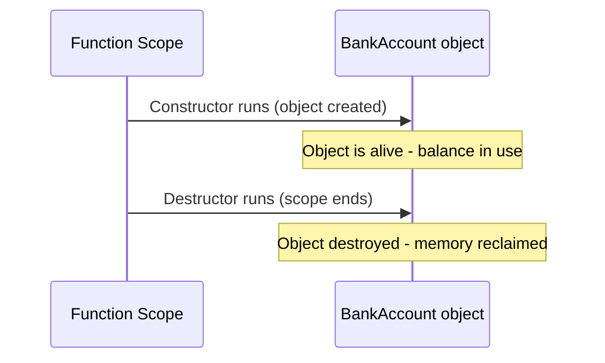

[⬅ Previous](./05-Introduction-to-OOP-and-Classes.md) &nbsp;|&nbsp; [🏠 C++ Course Home](./README.md) &nbsp;|&nbsp; Next ➡ [07. Operator Overloading](./07-Operator-Overloading.md)

---

# 📘 6. Constructors & Destructors

| | |
|---|---|
| **Difficulty** | 🟡 Intermediate |
| **Estimated Reading Time** | ~15 minutes |
| **Prerequisites** | [Lesson 5: Introduction to OOP & Classes](./05-Introduction-to-OOP-and-Classes.md) |

**Progress**
```
████████████░░░░░░░░░░░░░░  Lesson 6 of 15
```

---

## 🌟 Why Learn This?

In Lesson 5, you had to remember to call `setBalance()` right after creating every object - forget it, and `balance` holds garbage. **Constructors** fix this by running automatically the instant an object is born, guaranteeing it's never left in a broken state.

- This automatic setup/teardown pattern - **RAII** - is arguably C++'s single most important idea, and it's what makes smart pointers (Lesson 14) and file handling (Lesson 13) safe.
- Nearly every real class you'll ever write has at least one constructor.

---

## 🎯 By the End of This Lesson

You should know

✔ What a constructor is, and when it runs automatically

✔ How to overload constructors for different creation scenarios

✔ What a member initialization list is, and why it's preferred over assignment

✔ What a destructor is, and when it runs automatically

✔ What RAII means, and why it's central to safe C++ code

---

## 📚 Table of Contents

- [Before We Start](#-before-we-start)
- [Imagine This...](#-imagine-this)
- [Core Concepts](#-core-concepts)
- [Behind the Scenes](#-behind-the-scenes)
- [Visual Explanation](#-visual-explanation)
- [Code Example](#-code-example)
- [Predict the Output](#-predict-the-output)
- [Try It Yourself](#-try-it-yourself)
- [Mini Challenge](#-mini-challenge)
- [Real World Applications](#-real-world-applications)
- [Memory Tricks](#-memory-tricks)
- [Fun Fact](#-fun-fact)
- [Common Mistakes](#-common-mistakes)
- [Beginner Traps](#-beginner-traps)
- [Exam Tips](#-exam-tips)
- [Interview Questions](#-interview-questions)
- [Quiz](#-quiz)
- [Summary](#-summary)
- [What's Next?](#-whats-next)
- [References](#-references)

---

## 🧠 Before We Start

You should be comfortable with:

- Classes and member functions from Lesson 5.
- Function overloading from Lesson 3 - constructors are overloaded the same way.

---

## 💡 Imagine This...

Imagine ordering a car. You don't buy an empty shell and then separately, manually, bolt on an engine, wheels, and seats one at a time before you can drive it. The factory (**constructor**) assembles a fully working car in one step, the moment it rolls off the line.

And when the car is finally scrapped, there's a teardown process too - fluids drained, battery removed safely. That's the **destructor**: cleanup that happens automatically the moment the object's life ends, so nothing is left leaking.

---

## 📖 Core Concepts

### Constructors

A **constructor** is a special member function that shares the class's name, has no return type, and runs automatically when an object is created.

```cpp
class BankAccount {
private:
    double balance;

public:
    BankAccount() {              // default constructor
        balance = 0;
    }

    BankAccount(double initial) { // overloaded constructor
        balance = initial;
    }
};

BankAccount a;          // calls BankAccount() -> balance = 0
BankAccount b(500);      // calls BankAccount(double) -> balance = 500
```

Constructors can be **overloaded** exactly like ordinary functions (Lesson 3) - the compiler picks the right one based on the arguments you supply.

### Member Initialization Lists

```cpp
class BankAccount {
private:
    double balance;

public:
    BankAccount(double initial) : balance(initial) {   // initialization list
        // constructor body can stay empty
    }
};
```

| Approach | What happens |
|---|---|
| `balance = initial;` in the body | `balance` is first default-constructed, *then* assigned - two steps |
| `: balance(initial)` | `balance` is constructed directly with its final value - one step |

For simple types like `double` the difference is negligible, but for class-type members (like a `std::string`), the initialization list avoids a wasted default construction - it becomes a real performance habit, and many style guides require it.

### Destructors

A **destructor** runs automatically when an object's lifetime ends - it's named `~ClassName()`, takes no parameters, and can't be overloaded (there's only ever one per class).

```cpp
class BankAccount {
public:
    BankAccount() {
        std::cout << "Account opened" << std::endl;
    }

    ~BankAccount() {
        std::cout << "Account closed" << std::endl;
    }
};

void openTemporaryAccount() {
    BankAccount temp;   // constructor runs here
}   // destructor runs HERE, automatically, as temp goes out of scope
```

### RAII - Resource Acquisition Is Initialization

**RAII** is the pattern where a resource (memory, a file handle, a network connection) is acquired in a constructor and released in the matching destructor. Because destructors run automatically - even if an exception is thrown (Lesson 11) - RAII guarantees cleanup happens, without the programmer having to remember to call it manually.

```cpp
class FileHandler {
public:
    FileHandler() {
        // open the file here (constructor = acquisition)
    }
    ~FileHandler() {
        // close the file here (destructor = release), automatically
    }
};
```

This is precisely how `std::vector` frees its heap memory automatically, and how `std::unique_ptr` (Lesson 14) automates `delete` - both are RAII wrappers.

---

## 🔍 Behind the Scenes

**Stack-allocated objects:**
- The compiler inserts the destructor call automatically at the exact point the object goes out of scope - at the closing `}` of whichever block declared it.
- For multiple objects, this happens in reverse order of creation.
- It happens even if the function returns early, or an exception unwinds through that scope - which is exactly why RAII is considered exception-safe by design (more in Lesson 11).

**Heap-allocated objects** (`new BankAccount()`):
- The destructor only runs when you explicitly call `delete` on it.
- The compiler has no way to know when you're "done" with heap memory.
- That's the core reason manual heap management (Lesson 4) is riskier than stack-based RAII.

---

## 🖥 Visual Explanation



---

## 💻 Code Example

```cpp
#include <iostream>

class BankAccount {
private:
    double balance;

public:
    BankAccount(double initial) : balance(initial) {
        std::cout << "Account opened with balance " << balance << std::endl;
    }

    ~BankAccount() {
        std::cout << "Account closed. Final balance: " << balance << std::endl;
    }

    void deposit(double amount) {
        balance += amount;
    }
};

int main() {
    std::cout << "Before opening account" << std::endl;
    {
        BankAccount acc(100);
        acc.deposit(50);
        std::cout << "Inside block, using account" << std::endl;
    }   // acc goes out of scope HERE - destructor runs automatically
    std::cout << "After account is closed" << std::endl;
    return 0;
}
```

**Expected Output:**
```
Before opening account
Account opened with balance 100
Inside block, using account
Account closed. Final balance: 150
After account is closed
```

**Step-by-step execution:**
1. `BankAccount acc(100);` calls the constructor, printing the "opened" message and setting `balance` via the initialization list.
2. `acc.deposit(50);` raises `balance` to `150`.
3. The inner `{ ... }` block ends - `acc` goes out of scope, and its destructor runs *automatically*, with no explicit call anywhere in the code.
4. Execution continues in `main` after the block.

**Why it works:** you never wrote `acc.close()` or `delete acc` anywhere - the compiler guarantees the destructor runs the moment `acc`'s scope ends, which is the entire promise of RAII.

---

## 🎮 Predict the Output

```cpp
#include <iostream>
using namespace std;

class Logger {
public:
    Logger() { cout << "Created" << endl; }
    ~Logger() { cout << "Destroyed" << endl; }
};

int main() {
    cout << "Start" << endl;
    Logger a;
    Logger b;
    cout << "End" << endl;
    return 0;
}
```

<details>
<summary>💡 Reveal the answer</summary>

```
Start
Created
Created
End
Destroyed
Destroyed
```

`main`'s objects are destroyed at the end of `main`, in **reverse** order of creation - `b` (created second) is destroyed first.
</details>

---

## 🧪 Try It Yourself

Modify the code example above to:
1. Add a second, no-argument constructor `BankAccount()` that defaults `balance` to `0`, and create an object using it.
2. Add a `withdraw` function and print a message from inside the destructor showing whether the account ends in a positive or zero balance.
3. Remove the initialization list (use body assignment instead) and confirm the output is identical - the difference here is efficiency, not correctness.

---

## 🎯 Mini Challenge

Design a `Timer` class whose constructor prints `"Timer started"` and whose destructor prints `"Timer stopped"`. Create a `Timer` object inside a function (not `main`) and call that function from `main`, to see the constructor and destructor both fire automatically as the function begins and ends.

<details>
<summary>💡 Need a hint?</summary>

You don't need any member variables at all for this - just the two constructor/destructor print statements are enough to observe the pattern.
</details>

---

## 🌍 Real World Applications

| Concept | Where it shows up |
|---|---|
| Constructors | Every object creation across every C++ codebase - UI widgets, game entities, network sockets |
| Destructors + RAII | `std::lock_guard` in multithreaded code - a mutex is automatically unlocked when the guard object's destructor runs, even if an exception occurs |
| RAII | `std::fstream` (Lesson 13) - files are automatically closed when the stream object goes out of scope |

---

## 🧠 Memory Tricks

- **Constructor = the factory that assembles the car. Destructor = the teardown crew when it's scrapped. Both happen automatically.**
- **RAII = "the resource's lifetime IS the object's lifetime" - acquire in the constructor, release in the destructor.**

---

## 🎉 Fun Fact

RAII was one of Bjarne Stroustrup's earliest and most personally cherished inventions - he's said in interviews that it emerged directly from wanting exception handling (Lesson 11) to be *safe by default*, without programmers needing scattered manual cleanup code in every possible exit path of a function.

---

## ⚠ Common Mistakes

```cpp
// ❌ Wrong - constructor given a return type, which is invalid
class Account {
public:
    void Account() { }   // this is NOT a constructor - it's an unrelated function named Account
};

// ✅ Correct - no return type at all
class Account {
public:
    Account() { }
};
```
*Why:*
- The moment you add a return type - even `void` - the compiler no longer recognizes it as a constructor.
- It becomes an ordinary member function that happens to share the class's name.
- That almost never does what a beginner intended.

---

## 🚫 Beginner Traps

- **"I need to manually call the destructor when I'm done with a stack object."** Never do this for stack objects - the compiler already calls it automatically at the end of scope; calling it manually causes it to run twice, which is undefined behavior.
- **"Constructors and destructors can be overloaded the same way."** Constructors, yes. Destructors, no - a class can have exactly one destructor, since there's only ever one way an object's life can end.

---

## 📌 Exam Tips

- Know the exact syntax rule: constructors and destructors have **no return type**, not even `void`.
- Destruction order for local objects is **reverse of construction order** - a frequently tested trace question.
- "Member initialization list vs. assignment in the body" is a common short-answer comparison - know that the list constructs directly, while assignment constructs-then-overwrites.

---

## 🎤 Interview Questions

**Q: What is RAII, and why is it important in C++?**
- Resource Acquisition Is Initialization: tying a resource's lifetime to an object's lifetime, acquiring it in the constructor and releasing it in the destructor.
- Because destructors run automatically and deterministically (even during exception unwinding), RAII guarantees resources are released without relying on the programmer remembering to do it manually.

**Q: Can a class have multiple destructors?**
- No - unlike constructors, a class can only have exactly one destructor, since it takes no parameters and there's only one way for an object's lifetime to end.

---

## ❓ Quiz

**Multiple Choice**

1. When does a constructor run? <br>
   A) Only when explicitly called  
   B) Automatically when an object is created  
   C) Only for global objects  
   D) Only if you write `new`

2. What is the return type of a constructor? <br>
   A) `void`  
   B) The class's own type  
   C) No return type at all  
   D) `int`

3. Can destructors be overloaded? <br>
   A) Yes, freely  
   B) No, a class has exactly one destructor  
   C) Only with default arguments  
   D) Yes, up to 3 times

4. What does RAII tie together? <br>
   A) A resource's lifetime and an object's lifetime  
   B) Two unrelated classes  
   C) A function's name and its return type  
   D) Global variables and local variables

5. In what order are local objects destroyed at the end of a scope? <br>
   A) Same order as creation  
   B) Reverse order of creation  
   C) Alphabetical order  
   D) Random order

<details><summary>✅ Reveal Answers</summary>

1. B  2. C  3. B  4. A  5. B
</details>

**True / False**

1. A destructor's name is the class name prefixed with `~`.
2. Member initialization lists construct members directly, avoiding a redundant default construction.
3. You should manually call a stack object's destructor when you're finished using it.

<details><summary>✅ Reveal Answers</summary>

1. True  2. True  3. False
</details>

**Short Answer**

1. Why does RAII make exception-safe cleanup easier than manually calling a `close()` or `cleanup()` function?

<details><summary>✅ Reveal Guidance</summary>

- The destructor runs automatically whenever an object's scope ends - including when an exception is thrown and the stack unwinds through that scope.
- Cleanup happens no matter which exit path the code takes.
- A manual `close()`/`cleanup()` function, by contrast, has to be remembered and correctly placed on every single exit path - including ones the programmer might not anticipate.
</details>

---

## 📝 Summary

You now know how constructors guarantee an object starts in a valid state automatically, how destructors guarantee cleanup happens automatically, and why that pairing - RAII - is one of C++'s most important design patterns. This automatic lifecycle management is what makes the rest of modern C++, from `std::vector` to smart pointers, safe to use without constant manual bookkeeping.

---

## 🚀 What's Next?

In the next lesson, you'll learn **operator overloading** - teaching operators like `+` and `<<` to work with your own classes, so `account1 + account2` can mean exactly what you want it to.

---

## 📚 References

- Stroustrup, B. - *The C++ Programming Language* (4th Edition), Addison-Wesley.
- ISO/IEC 14882 - the official C++ Language Standard.

---

[⬅ Previous](./05-Introduction-to-OOP-and-Classes.md) &nbsp;|&nbsp; [🏠 C++ Course Home](./README.md) &nbsp;|&nbsp; Next ➡ [07. Operator Overloading](./07-Operator-Overloading.md)
