# 🅲➕➕ C++ Programming

> Take everything C taught you about how computers think, and learn how to organize it into things that scale.

Part of [📚 OpenStudyNotes](../README.md) - *Learn Computer Science by Understanding, Not Memorizing.*

---

## 🧭 About This Course

C++ takes C's speed and closeness to the machine, and adds object-oriented programming, templates, and a massive standard library on top.

- This course takes you from "what does C++ add over C?" all the way through OOP, templates, the STL, and modern C++ memory management.
- **15 lessons**, each written as an interactive chapter, not a lecture slide.

**Every lesson includes:**
- Analogies and real-world comparisons
- ASCII / Mermaid diagrams
- Worked code examples
- Predict-the-output challenges
- Mini and full coding challenges
- Common mistakes & beginner traps
- Exam tips & interview questions
- A self-graded quiz

---

## 📖 Lessons

| # | Lesson | Difficulty | Focus |
|---|---|---|---|
| 1 | [Introduction to C++](./01-Introduction-to-Cpp.md) | 🟢 Beginner | C vs C++, `iostream`, compiling, `namespace std` |
| 2 | [Variables, References & I/O](./02-Variables-References-and-IO.md) | 🟢 Beginner | `cin`/`cout`, references vs pointers |
| 3 | [Functions & Overloading](./03-Functions-and-Overloading.md) | 🟢 Beginner | Default args, overloading, inline functions |
| 4 | [Pointers, Arrays & Dynamic Memory](./04-Pointers-Arrays-and-Dynamic-Memory.md) | 🟡 Intermediate | `new`/`delete`, arrays vs `std::array` |
| 5 | [Introduction to OOP & Classes](./05-Introduction-to-OOP-and-Classes.md) | 🟡 Intermediate | Objects, encapsulation, access specifiers |
| 6 | [Constructors & Destructors](./06-Constructors-and-Destructors.md) | 🟡 Intermediate | Overloaded ctors, initialization lists, RAII |
| 7 | [Operator Overloading](./07-Operator-Overloading.md) | 🟡 Intermediate | `+`, `<<`, copy constructor, `this` |
| 8 | [Inheritance](./08-Inheritance.md) | 🟡 Intermediate | `public`/`protected`/`private` inheritance |
| 9 | [Polymorphism](./09-Polymorphism.md) | 🟡 Intermediate | Virtual functions, vtables, abstract classes |
| 10 | [Templates](./10-Templates.md) | 🟡 Intermediate | Function & class templates, generic programming |
| 11 | [Exception Handling](./11-Exception-Handling.md) | 🟡 Intermediate | `try`/`catch`/`throw`, custom exceptions |
| 12 | [The Standard Template Library (STL)](./12-Standard-Template-Library.md) | 🟡 Intermediate | `vector`, `map`, iterators, algorithms |
| 13 | [File Handling in C++](./13-File-Handling.md) | 🟡 Intermediate | `fstream`, reading/writing objects |
| 14 | [Smart Pointers & Modern C++](./14-Smart-Pointers-and-Modern-Cpp.md) | 🔴 Advanced | `unique_ptr`, `shared_ptr`, move semantics |
| 15 | [Structures, Unions & Capstone](./15-Structures-Unions-and-Capstone.md) | 🟡 Intermediate | `struct` vs `class`, final capstone project |

---

## 🗺 Suggested Path

```mermaid
flowchart LR
    A[1. Intro to C++] --> B[2. Variables & I/O]
    B --> C[3. Functions]
    C --> D[4. Pointers & Memory]
    D --> E[5. Classes]
    E --> F[6. Constructors]
    F --> G[7. Operator Overloading]
    G --> H[8. Inheritance]
    H --> I[9. Polymorphism]
    I --> J[10. Templates]
    J --> K[11. Exceptions]
    K --> L[12. STL]
    L --> M[13. File Handling]
    M --> N[14. Smart Pointers]
    N --> O[15. Capstone]
```

Go in order - lessons 1-4 are procedural warm-ups, lessons 5-9 build OOP from the ground up, and 10-15 cover the tools that make modern C++ modern.

---

## ✅ Prerequisites

None required, though finishing the [C course](../C/README.md) first will make lessons 1-4 feel like a fast refresher rather than new material.

You'll need a C++ compiler (`g++` or Clang, C++17 or later recommended) or an online compiler like [Compiler Explorer](https://godbolt.org).

---

## 🚀 After This Course

- **Data Structures in C++** - implementing linked lists, trees, and graphs using classes and templates *(coming soon)*
- **Design Patterns** - Singleton, Factory, Observer, and more, in C++ *(coming soon)*

---

⭐ If this course is helping you, consider starring the [OpenStudyNotes repository](../README.md) and sharing it with a classmate.

[🏠 Back to OpenStudyNotes Home](../README.md)
