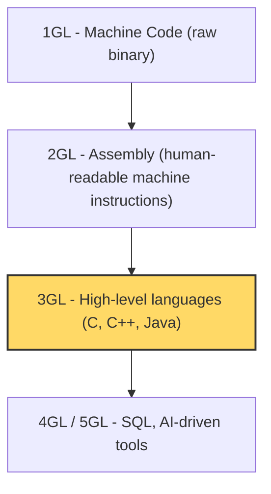
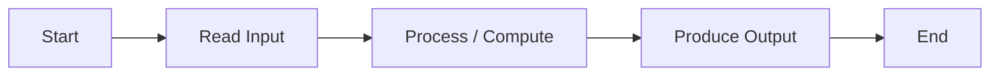

[🏠 C Course Home](./README.md) &nbsp;|&nbsp; Next ➡ [02. Data Types, Variables & I/O](./02-Data-Types-Variables-IO.md)

---

# 📘 1. Programming Fundamentals

| | |
|---|---|
| **Difficulty** | 🟢 Beginner |
| **Estimated Reading Time** | ~15 minutes |
| **Prerequisites** | None - just curiosity |

**Progress**
```
██░░░░░░░░░░░░░░░░░░░░░░░░  Lesson 1 of 13
```

---

## 🌟 Why Learn This?

Before you write a single line of code, let's answer the question nobody asks but everybody should: **why does C even exist, and why are people still learning it in 2026?**

- **Origin:** C was created in 1972 by Dennis Ritchie at Bell Labs, originally to rewrite the UNIX operating system.
- **Why it mattered:** an operating system could finally be written in a language humans could read, instead of raw assembly.

**Almost everything you use today has C hiding underneath it:**

- The **Linux kernel** (which powers Android, most servers, and basically the entire internet) is written in C.
- **Python**, **Ruby**, and parts of **PHP** - their interpreters are written in C.
- **Git**, the tool every developer eventually learns, is written in C.
- Every **embedded system** - car engine controllers, microwave chips, pacemakers, satellites - runs C because it's small, fast, and predictable.

C doesn't hold your hand. Learning it means learning **how computers actually think** - memory addresses, bytes, instructions - instead of an abstraction sitting on top of that. Once you understand C, every other language feels like C with comfortable furniture added.

---

## 🎯 By the End of This Lesson

You should know

✔ What "programming" actually means, and the cycle every programmer repeats

✔ The difference between a flowchart and pseudocode, and when to use each

✔ Where C sits in the history of programming languages

✔ The difference between a compiler and an interpreter - and why that makes C fast

✔ The skeleton of every C program, line by line

✔ The three types of programming errors, and which one is hardest to catch

---

## 📚 Table of Contents

- [Before We Start](#-before-we-start)
- [Imagine This...](#-imagine-this)
- [Core Concepts](#-core-concepts)
- [Behind the Scenes](#-behind-the-scenes)
- [Visual Explanation](#-visual-explanation)
- [Code Example](#-code-example)
- [Predict the Output](#-predict-the-output)
- [Try It Yourself](#-try-it-yourself)
- [Mini Challenge](#-mini-challenge)
- [Real World Applications](#-real-world-applications)
- [Memory Tricks](#-memory-tricks)
- [Fun Fact](#-fun-fact)
- [Common Mistakes](#-common-mistakes)
- [Beginner Traps](#-beginner-traps)
- [Exam Tips](#-exam-tips)
- [Interview Questions](#-interview-questions)
- [Quiz](#-quiz)
- [Summary](#-summary)
- [What's Next?](#-whats-next)
- [References](#-references)

---

## 🧠 Before We Start

You don't need any prior programming knowledge for this lesson. You should have:

- A C compiler installed (GCC is standard), **or** an online compiler like [Compiler Explorer](https://godbolt.org) or [Replit](https://replit.com).
- A text editor (VS Code is a great free choice).
- Patience - C will reward you generously, but it will also throw errors at you, and that's completely normal.

---

## 💡 Imagine This...

Imagine teaching someone to bake a cake **over the phone**, and they've never baked anything before. You can't just say "make a cake" - that's meaningless. You have to break it down:

1. Preheat the oven to 180°C.
2. Mix 200g flour with 2 eggs.
3. Pour the mixture into a tin.
4. Bake for 30 minutes.

Notice what you just did without realizing it:

- You gave **precise, ordered instructions** (an algorithm).
- You specified **exact inputs** - 200g, 2 eggs, not "some flour."
- You expected a **specific output** - a baked cake, not a burnt one.
- If they mixed the steps up (baked before mixing), they'd get the **wrong result even though they followed instructions** - that's exactly what a *logical error* is in code.

**Programming is the exact same skill, aimed at a computer instead of a person.** The difference is a computer is far less forgiving. It will not "figure out what you meant." That strictness is not the computer being difficult - it's the computer being **honest**.

Keep that recipe metaphor in your back pocket. We'll return to it throughout this course.

---

## 📖 Core Concepts

**Programming** is the act of solving a problem by giving a computer a precise, step-by-step set of instructions. Just like the cake recipe, good programming follows a repeating cycle:

```
Understand the problem → Plan (Algorithm) → Implement (Code) → Test
```

Before writing any code, professionals force themselves to answer two boring but critical questions:

| Question | You must define... |
|---|---|
| **Input specification** | What is the input? What format? What values are legal/illegal? How many inputs? |
| **Output specification** | What values come out? In what format? Any headers or labels? How much data? |

Skipping this step is like starting to bake before checking whether you actually have eggs.

### Representing an Algorithm

| Representation | What it looks like |
|---|---|
| **Flowchart** | Oval = Start/End, Parallelogram = Input/Output, Rectangle = Process, Diamond = Decision |
| **Pseudocode** | Structured, English-like steps, usually wrapped in `START ... END` |

### Where C Sits in the Timeline of Languages



C is a **3rd Generation Language (3GL)**. It's high-level compared to assembly, but still low-level enough to talk to memory directly - which is exactly why it sits at the foundation of operating systems.

### How C Code Becomes a Running Program

Your code passes through a *translator*:

| Translator | What it does |
|---|---|
| **Assembler** | Converts assembly language → machine code |
| **Compiler** | Converts the *entire* program to machine code **before** running it (what C uses) |
| **Interpreter** | Converts and runs code **line by line**, on the fly (what Python uses) |

This is a big reason C programs run so fast: all the translation happens once, upfront, during compilation - not repeatedly while the program runs.

### The Development Cycle

```
Edit → Compile → Run → Debug → (back to Edit)
```

### Three Kinds of Errors

| Error Type | When it happens | Who catches it |
|---|---|---|
| **Syntax error** | You broke C's grammar rules (e.g. missing `;`) | The compiler - easiest to catch |
| **Run-time error** | Something illegal happens *while* running (e.g. dividing by zero) | The OS / the program crashes |
| **Logical error** | Code runs and compiles fine, but the *answer is wrong* | **Only you** - hardest to detect |

> **Exam trick:** "Which error type is hardest to detect?" → **Logical error**, because the compiler is happy and the program doesn't crash - it just quietly lies to you.

### The Skeleton of Every C Program

```c
#include <stdio.h>   // header inclusion - gives us access to printf, scanf, etc.

int main() {          // entry point - execution ALWAYS starts here
    printf("Hello, World!");
    return 0;          // tells the OS the program finished successfully
}
```

Think of `main()` as the front door of your program. No matter how many other functions you write, the operating system only ever knocks on `main()` to start things running.

---

## 🔍 Behind the Scenes

Compilation is a pipeline, not one step:

```
your_code.c
   │  Preprocessing (expands #include, #define)
   ▼
Preprocessed code
   │  Compilation (C → Assembly)
   ▼
Assembly code
   │  Assembling (Assembly → machine code, produces an object file)
   ▼
object_file.o
   │  Linking (connects your code to library code like printf's implementation)
   ▼
executable (a.out / program.exe)
```

This is *why* a missing header or a missing library function causes a completely different kind of error than a missing semicolon - they fail at different pipeline stages.

---

## 🖥 Visual Explanation



That diagram is the universal shape of almost every program you will ever write - no matter the language.

---

## 💻 Code Example

```c
#include <stdio.h>

int main() {
    printf("Hello, World!\n");
    return 0;
}
```

**Expected Output:**
```
Hello, World!
```

**Step-by-step execution:**
1. `#include <stdio.h>` tells the preprocessor to pull in the declarations for `printf`.
2. `main()` begins execution - this is the entry point.
3. `printf` sends the text to the screen, and `\n` moves the cursor to a new line.
4. `return 0;` reports back to the operating system that the program finished successfully.

**Why it works:** every piece has exactly one job - including a header is what makes `printf` available at all, and `return 0` is a signal, not a printed value.

---

## 🎮 Predict the Output

```c
#include <stdio.h>

int main() {
    printf("Line 1\n");
    printf("Line 2");
    printf("Line 3\n");
    return 0;
}
```

<details>
<summary>💡 Reveal the answer</summary>

```
Line 1
Line 2Line 3
```

`\n` is what moves to a new line - without it after `"Line 2"`, `"Line 3"` prints immediately after it on the same line.
</details>

---

## 🧪 Try It Yourself

Modify the code example above to:
1. Print your name and university on two separate lines.
2. Add a third line that prints today's date as plain text.
3. Deliberately remove the semicolon after one `printf` line, compile it, and read the *exact* error message your compiler gives you - get comfortable with what a syntax error looks like.

---

## 🎯 Mini Challenge

Write a program that prints an ASCII art box around the text `"OpenStudyNotes"`, like this:

```
******************
* OpenStudyNotes *
******************
```

<details>
<summary>💡 Need a hint?</summary>

You only need `printf()` calls with `\n` between them - no loops or variables required yet. Count your asterisks carefully so the box lines up.
</details>

---

## 🌍 Real World Applications

| Concept | Where it shows up |
|---|---|
| Compilers | Every app on your phone was compiled before it ever ran |
| Algorithms | Google Maps' route-finding is fundamentally an algorithm, just like your recipe |
| Error types | Professional QA teams categorize bugs using exactly these three types |

---

## 🧠 Memory Tricks

- **Compiler = translates the WHOLE book before reading it aloud. Interpreter = translates and reads ONE line at a time.**
- **Syntax error = "you broke grammar." Logical error = "your sentence was legal, but it lied."**

---

## 🎉 Fun Fact

Dennis Ritchie, the creator of C, also co-created the UNIX operating system - and in 1983 he shared the **Turing Award** (computing's Nobel Prize) with Ken Thompson for exactly that work.

---

## ⚠ Common Mistakes

```c
// ❌ Wrong - missing semicolon
printf("Hello")

// ✅ Correct
printf("Hello");
```
*Why:* every C statement must end with `;` - this is the single most common beginner typo, and the compiler will refuse to build until it's fixed.

---

## 🚫 Beginner Traps

- **"A program that compiles is a correct program."** False - a logical error compiles perfectly and runs without crashing, yet still produces the wrong answer.
- **"C is 'old' so it's outdated."** C still powers your phone's OS, your browser's engine, and your internet router. Old doesn't mean irrelevant.

---

## 📌 Exam Tips

- If asked "which error is hardest to detect," the answer is always **logical error**.
- Know the exact translator vocabulary: **assembler, compiler, interpreter** - and be ready to say which one C uses.
- Be ready to draw or label a simple flowchart using the four standard shapes.

---

## 🎤 Interview Questions

**Q: What is the difference between a compiler and an interpreter?**
- A **compiler** translates the entire program into machine code *before* execution begins.
- An **interpreter** translates and executes code line by line, *as* the program runs.
- This is part of why compiled languages like C tend to run faster than interpreted ones.

**Q: Why does every C program need a `main()` function?**
- `main()` is the designated **entry point**.
- The operating system always starts execution there, regardless of how many other functions exist in the program.

---

## ❓ Quiz

**Multiple Choice**

1. Which error type is hardest to detect? <br>
   A) Syntax  
   B) Run-time   
   C) Logical  
   D) Linker

2. What does a compiler do? <br>
   A) Runs code line by line  
   B) Translates the whole program before running  
   C) Deletes bugs automatically  
   D) Formats your code

3. Which function is the entry point of every C program? <br>
   A) `start()`  
   B) `main()`  
   C) `run()`  
   D) `init()`

4. What is a flowchart's diamond shape used for? <br>
   A) Input/Output  
   B) Start/End  
   C) Decision  
   D) Process
   
5. What does `#include <stdio.h>` do? <br>
   A) Starts the program  
   B) Includes standard input/output declarations  
   C) Declares a variable  
   D) Ends the program

<details><summary>✅ Reveal Answers</summary>

1. C  2. B  3. B  4. C  5. B
</details>

**True / False**

1. A syntax error prevents the program from compiling.
2. An interpreter translates the entire program before running it.
3. `return 0;` in `main()` signals successful completion to the OS.

<details><summary>✅ Reveal Answers</summary>

1. True  2. False (that's a compiler)  3. True
</details>

**Short Answer**

1. Why is defining input/output specifications before coding considered good practice?

<details><summary>✅ Reveal Guidance</summary>

Because it forces you to fully understand the problem's boundaries - what data comes in, in what format, and what must come out - before you write a single line, which prevents wasted effort building the wrong solution.
</details>

---

## 📝 Summary

You now understand what programming actually is, the cycle every programmer repeats, where C sits historically, how compilers differ from interpreters, and the three types of errors you'll be hunting for the rest of this course. This is the mental foundation everything else in C builds on top of.

---

## 🚀 What's Next?

In the next lesson, you'll start actually storing data - **variables, data types, and input/output** - including the single most common bug in beginner C code.

---

## 📚 References

- Kernighan, B. W., & Ritchie, D. M. - *The C Programming Language* (2nd Edition), Prentice Hall.
- ISO/IEC 9899 - the official C Language Standard.

---

[🏠 C Course Home](./README.md) &nbsp;|&nbsp; Next ➡ [02. Data Types, Variables & I/O](./02-Data-Types-Variables-IO.md)
