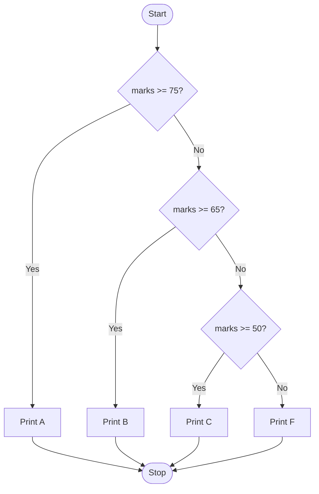

[⬅ Previous: 05. Pointers & Pass-by-Reference](./05-Pointers-and-Pass-by-Reference.md) &nbsp;|&nbsp; [🏠 C Course Home](./README.md) &nbsp;|&nbsp; Next ➡ [07. Loops & Unary Operators](./07-Loops-and-Unary-Operators.md)

---

# 📘 6. Decision Making

| | |
|---|---|
| **Difficulty** | 🟢 Beginner |
| **Estimated Reading Time** | ~14 minutes |
| **Prerequisites** | [Pointers & Pass-by-Reference](./05-Pointers-and-Pass-by-Reference.md) |

**Progress**
```
████████████░░░░░░░░░░░░░░  Lesson 6 of 13
```

---

## 🌟 Why Learn This?

Every non-trivial program eventually needs to make a choice:

- Log the user in *or* reject the password
- Apply a discount *or* charge full price
- Take the highway *or* the back road, depending on traffic

Decision-making is what turns a program from "a list of instructions" into something that can actually *react* to the world. It's also one of the richest sources of sneaky exam bugs - a single misplaced symbol changes the entire meaning of your program.

---

## 🎯 By the End of This Lesson

You should know

✔ Relational and logical operators, and their exact precedence order

✔ How to write `if`/`else if`/`else` ladders and `switch` statements correctly

✔ Why forgetting `break` inside a `switch` causes fall-through

✔ The single most common bug in all of C: `=` vs `==`

---

## 📚 Table of Contents

- [Before We Start](#-before-we-start)
- [Imagine This...](#-imagine-this)
- [Core Concepts](#-core-concepts)
- [Behind the Scenes](#-behind-the-scenes)
- [Visual Explanation](#-visual-explanation)
- [Code Example](#-code-example)
- [Predict the Output](#-predict-the-output)
- [Try It Yourself](#-try-it-yourself)
- [Mini Challenge](#-mini-challenge)
- [Real World Applications](#-real-world-applications)
- [Memory Tricks](#-memory-tricks)
- [Fun Fact](#-fun-fact)
- [Common Mistakes](#-common-mistakes)
- [Beginner Traps](#-beginner-traps)
- [Exam Tips](#-exam-tips)
- [Interview Questions](#-interview-questions)
- [Quiz](#-quiz)
- [Summary](#-summary)
- [What's Next?](#-whats-next)
- [References](#-references)

---

## 🧠 Before We Start

You should be comfortable with basic variable arithmetic from [Lesson 4](./04-Operators-and-Type-Conversion.md).

---

## 💡 Imagine This...

- Imagine standing at a fork in a hiking trail with a sign: *"If it's raining, take the left path (shelter). Otherwise, take the right path (scenic view)."*
- You check one condition, and that single check determines your entire route.
- Now imagine a more complex sign with five different forks depending on the weather, time of day, and how tired you are - that's an `if`/`else if` ladder.
- If there's a numbered sign with an option for every single day of the week, that's a `switch` statement - a cleaner way to write "compare this one variable against a bunch of specific values."

---

## 📖 Core Concepts

**Relational operators:** `<`  `<=`  `==`  `>`  `>=`  `!=`

**Logical operators:** `&&` (AND), `||` (OR), `!` (NOT)

### Precedence - a High-Value Exam Topic

From highest to lowest:

```
()   →   !   →   < <= > >=   →   == !=   →   &&   →   ||
```

> ⚠️ **A favorite "predict the output" trap:** `!a > b` is parsed as `(!a) > b` - **not** `!(a > b)`. The `!` binds tighter than `>`. Always add your own parentheses whenever `!` is nearby, to remove any ambiguity for both the compiler and the human reading your code.

### if / else-if Ladder

```c
if (marks >= 75)       printf("A");
else if (marks >= 65)  printf("B");
else if (marks >= 50)  printf("C");
else                    printf("F");
```

### switch Statement

```c
switch (day) {
    case 1: printf("Monday"); break;
    case 2: printf("Tuesday"); break;
    default: printf("Invalid");
}
```

> ⚠️ **Common exam "spot the bug":** forgetting `break;` causes **fall-through** - execution keeps running into the *next* case's code too, even though its condition was never checked.

### Ternary (Conditional) Operator

An `if-else` squeezed into one line:

```c
largest = (a > b) ? a : b;
```

### Errors to Watch For

- Writing `=` (assignment) when you meant `==` (comparison) - arguably the most common bug in all of C, in student code and professional code alike.
- Missing `{}` braces around a multi-statement block.
- A missing `break;` inside `switch`.

---

## 🔍 Behind the Scenes

- At the CPU level, an `if` statement compiles down to a **conditional jump instruction**.
- The processor evaluates the condition, and based on true/false, either jumps to a different part of the compiled code or falls through to the next instruction in sequence.
- A `switch` statement is often compiled into a **jump table** (when the cases are dense enough).
- Instead of checking each case one by one like a chain of `if`s, the CPU can jump directly to the matching case's code in a single step - part of why `switch` can be faster than an equivalent `if`/`else if` chain for many cases.

---

## 🖥 Visual Explanation



---

## 💻 Code Example

```c
#include <stdio.h>

int main() {
    int marks;
    printf("Enter marks: ");
    scanf("%d", &marks);

    if (marks >= 75) {
        printf("Grade: A\n");
    } else if (marks >= 65) {
        printf("Grade: B\n");
    } else if (marks >= 50) {
        printf("Grade: C\n");
    } else {
        printf("Grade: F\n");
    }

    return 0;
}
```

**Expected Output** (if the user enters `70`):
```
Enter marks: 70
Grade: B
```

**Step-by-step execution:**
1. `marks = 70` is read.
2. `marks >= 75` is false, so we move to the next check.
3. `marks >= 65` is true - `"Grade: B"` prints, and the ladder stops here entirely (the remaining `else if`/`else` are skipped).

**Why it works:** an `else if` ladder only evaluates conditions until one is true - it never checks the rest once a match is found.

---

## 🎮 Predict the Output

```c
int a = 4, b = 6;
if (!a > b)
    printf("Yes");
else
    printf("No");
```

<details>
<summary>💡 Reveal the answer</summary>

`No`

`!a` evaluates first (since `!` has higher precedence than `>`). `a` is `4` (non-zero, "true"), so `!a` becomes `0`. The comparison becomes `0 > 6`, which is false - hence `"No"`.
</details>

---

## 🧪 Try It Yourself

Modify the grade example to also accept and validate the input: if `marks` is less than 0 or greater than 100, print `"Invalid marks!"` instead of assigning any grade.

---

## 🎯 Mini Challenge

Write a program using `switch` that takes a number 1–7 and prints the corresponding day of the week, with a `default` case that prints `"Invalid day"` for anything else.

<details>
<summary>💡 Need a hint?</summary>

Don't forget `break;` after every case - including the last one, as good practice, even though it's not strictly required there.
</details>

---

## 🌍 Real World Applications

| Concept | Where it shows up |
|---|---|
| Decision making | Every login system uses conditional logic to compare a submitted password against the stored one |
| `switch` statements | Menu-driven console applications and state machines (like a traffic light controller) are built almost entirely from `switch` |
| Ternary operator | Used constantly in real codebases for short, readable one-line conditional assignments |

---

## 🧠 Memory Tricks

- **`=` assigns, `==` asks a question.** One equals sign *does* something; two equals signs *checks* something.
- **Precedence memory device:** "**P**arentheses **N**ever **R**elax **E**quality **A**nd **O**r" → `()`, `!`, relational, `==`/`!=`, `&&`, `||`.
- **`switch` without `break` = a leaky pipe** - everything downstream keeps flowing until it hits a wall (`break`) or the end.

---

## 🎉 Fun Fact

The `switch` statement's "fall-through" behavior is not a design flaw - it was intentional, allowing multiple case labels to share the same block of code by deliberately omitting `break`. Later languages like Swift and Go changed this default (their `switch` doesn't fall through automatically) specifically because so many C bugs came from forgetting `break`.

---

## ⚠ Common Mistakes

```c
// ❌ Wrong
if (x = 5) { printf("x is five"); }   // this ASSIGNS 5 to x, and 5 is "truthy" - always runs!

// ✅ Correct
if (x == 5) { printf("x is five"); }
```
*Why:* `=` assigns and returns the assigned value; `==` compares. This bug is dangerous precisely because the code still compiles and runs - it just silently does the wrong thing.

```c
// ❌ Wrong - missing break causes fall-through
switch (day) {
    case 1: printf("Mon");
    case 2: printf("Tue");   // runs even if day == 1!
}

// ✅ Correct
switch (day) {
    case 1: printf("Mon"); break;
    case 2: printf("Tue"); break;
}
```

---

## 🚫 Beginner Traps

- **"`!a > b` means `!(a > b)`."** False - `!` binds tighter than `>`, so it's actually `(!a) > b`. Always parenthesize explicitly.
- **"switch can compare strings directly."** False - C's `switch` only works with integer types (`int`, `char`), not strings. Comparing strings requires `strcmp()` inside an `if` chain instead.

---

## 📌 Exam Tips

- Precedence questions involving `!` are extremely common - always mentally add explicit parentheses before evaluating.
- If a "spot the bug" question shows a `switch` without visible `break;` statements, fall-through is almost certainly the intended answer.
- `=` vs `==` inside an `if` condition is a guaranteed trick somewhere on every exam paper covering this topic.

---

## 🎤 Interview Questions

**Q: What's the difference between `=` and `==`?**
> `=` is the assignment operator, storing a value into a variable. `==` is the equality comparison operator, checking whether two values are equal and yielding a boolean-like result (1 or 0). Accidentally using `=` inside a condition is a classic C bug because the assignment's resulting value is still evaluated as true/false.

**Q: Why might a `switch` statement be preferred over a long `if`/`else if` chain?**
> It's often more readable when comparing one variable against many discrete values, and the compiler can sometimes optimize it into a direct jump table, making it faster than checking conditions sequentially.

---

## ❓ Quiz

**Multiple Choice**

1. What does `==` do? <br>
   A) Assigns a value  
   B) Compares for equality  
   C) Adds two numbers  
   D) Declares a variable
2. What happens if `break;` is omitted in a `switch` case? <br>
   A) A compiler error  
   B) Fall-through to the next case  
   C) The switch exits immediately  
   D) Nothing changes
3. What is the result of `!a > b` when `a = 4`, `b = 6`? <br>
   A) True  
   B) False  
   C) Syntax error  
   D) Undefined
4. Which operator has the highest precedence among these? <br>?
   A) `&&`  
   B) `==`  
   C) `!`  
   D) `||`
5. What does the ternary operator `(a > b) ? a : b` return? <br>
   A) Always `a`  
   B) Always `b`  
   C) The larger of `a` and `b` 
   D) A boolean

<details><summary>✅ Reveal Answers</summary>

1. B  2. B  3. B  4. C  5. C
</details>

**True / False**

1. `if (x = 5)` will always evaluate as true, because assignment expressions evaluate to the assigned value.
2. `switch` in C can compare string values directly.
3. `&&` has higher precedence than `==`.

<details><summary>✅ Reveal Answers</summary>

1. True  2. False  3. False (`==` binds tighter than `&&`)
</details>

**Short Answer**

1. Why is `if (x = 5)` considered a dangerous bug rather than a harmless typo?

<details><summary>✅ Reveal Guidance</summary>

Because it compiles without error and actually executes - it assigns 5 to `x` and then evaluates that assignment's result (5, which is non-zero/"truthy") as the condition, so the `if` block always runs regardless of `x`'s original value, silently producing incorrect program behavior instead of failing loudly.
</details>

---

## 📝 Summary

You can now write `if`/`else if` ladders and `switch` statements correctly, understand operator precedence (especially around `!`), and know exactly why `break` matters and why `=` inside a condition is dangerous. These decision-making tools are what let your programs actually respond to different situations.

---

## 🚀 What's Next?

Next: **loops** - how to repeat work efficiently, along with the pre/post-increment distinction that shows up in nearly every "predict the output" question you'll ever face.

---

## 📚 References

- Kernighan, B. W., & Ritchie, D. M. - *The C Programming Language* (2nd Edition), Prentice Hall.
- [cppreference.com - Operator precedence](https://en.cppreference.com/w/c/language/operator_precedence)

---

[⬅ Previous: 05. Pointers & Pass-by-Reference](./05-Pointers-and-Pass-by-Reference.md) &nbsp;|&nbsp; [🏠 C Course Home](./README.md) &nbsp;|&nbsp; Next ➡ [07. Loops & Unary Operators](./07-Loops-and-Unary-Operators.md)
