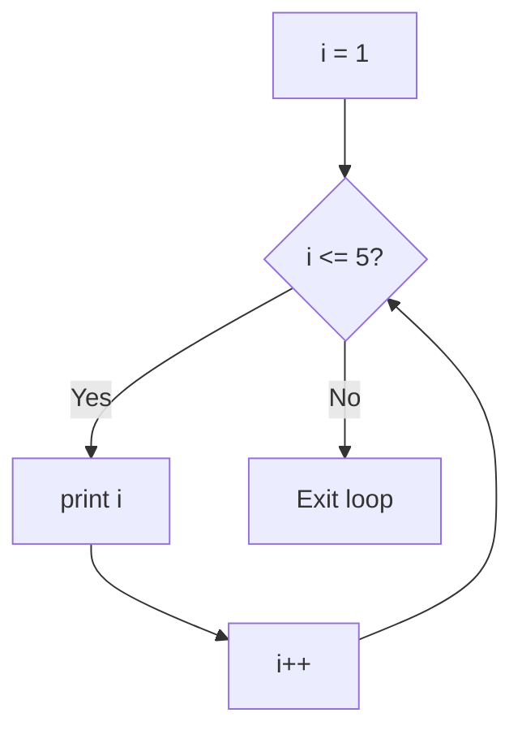

[⬅ Previous: 06. Decision Making](./06-Decision-Making.md) &nbsp;|&nbsp; [🏠 C Course Home](./README.md) &nbsp;|&nbsp; Next ➡ [08. Character Processing](./08-Character-Processing.md)

---

# 📘 7. Unary Operators & Loops

| | |
|---|---|
| **Difficulty** | 🟢 Beginner |
| **Estimated Reading Time** | ~14 minutes |
| **Prerequisites** | [Decision Making](./06-Decision-Making.md) |

**Progress**
```
██████████████░░░░░░░░░░░░  Lesson 7 of 13
```

---

## 🌟 Why Learn This?

- Computers are extraordinary at doing the same boring thing thousands of times without complaining.
- Loops are what unlock that superpower - processing every row of a spreadsheet, checking every pixel of an image, retrying a failed network request.
- Without loops, every repeated action would need its own hand-written line of code, which simply doesn't scale.
- Within loops lives the single most commonly tested "predict the output" concept in this entire course: **pre vs. post increment**.

---

## 🎯 By the End of This Lesson

You should know

✔ The difference between pre-increment (`++a`) and post-increment (`a++`)

✔ The three loop types in C, and exactly when each one checks its condition

✔ How to choose the right loop for a given situation

✔ The difference between `break` and `continue`

---

## 📚 Table of Contents

- [Before We Start](#-before-we-start)
- [Imagine This...](#-imagine-this)
- [Core Concepts](#-core-concepts)
- [Behind the Scenes](#-behind-the-scenes)
- [Visual Explanation](#-visual-explanation)
- [Code Example](#-code-example)
- [Predict the Output](#-predict-the-output)
- [Try It Yourself](#-try-it-yourself)
- [Mini Challenge](#-mini-challenge)
- [Real World Applications](#-real-world-applications)
- [Memory Tricks](#-memory-tricks)
- [Fun Fact](#-fun-fact)
- [Common Mistakes](#-common-mistakes)
- [Beginner Traps](#-beginner-traps)
- [Exam Tips](#-exam-tips)
- [Interview Questions](#-interview-questions)
- [Quiz](#-quiz)
- [Summary](#-summary)
- [What's Next?](#-whats-next)
- [References](#-references)

---

## 🧠 Before We Start

You should be comfortable with `if` conditions from [Lesson 6](./06-Decision-Making.md) - loops repeatedly check a condition, exactly like `if` does.

---

## 💡 Imagine This...

Imagine a security guard checking IDs at a club entrance:

- A **`while` loop** is a guard who checks your ID *before* letting you in every single time - if your ID is invalid on the first check, you never get in at all.
- A **`do-while` loop** is a guard who lets you in first, *then* checks your ID - so you're guaranteed at least one entry, even if it turns out you shouldn't have been let in.
- A **`for` loop** is a guard managing a scheduled event with a known guest list - they already know exactly how many people are coming, and they count them off one by one.

---

## 📖 Core Concepts

**Unary operators** act on a *single* operand: `++` `--` `-` `+` `!` `sizeof` `&` `*`

### Pre vs. Post Increment - the Single Most Classic "Predict the Output" Question in the Entire Course

```c
int a = 5;
printf("%d", a++);   // prints 5 - use the OLD value first, THEN increase → a becomes 6
printf("%d", ++a);   // prints 7 - increase FIRST, THEN use the new value
```

> 🧠 **Memory trick:** Post (`a++`) = *"use now, increase later."* Pre (`++a`) = *"increase now, use immediately."*

### The Three Loops, and When Their Condition Is Actually Checked

| Loop | Condition checked | Guaranteed to run at least once? |
|---|---|---|
| `while` | Before each iteration | No - may run 0 times |
| `do-while` | After each iteration | **Yes** - always runs ≥ 1 time |
| `for` | Before each iteration | No - may run 0 times |

```c
while (i <= 5) { printf("%d\n", i); i++; }

do { printf("%d\n", i); i++; } while (i <= 5);

for (int i = 1; i <= 5; i++) { printf("%d\n", i); }
```

### Choosing the Right Loop (a Genuine Exam Favorite)

| Situation | Best loop |
|---|---|
| Number of repetitions is known upfront | `for` |
| Number of repetitions is unknown | `while` |
| Must execute at least once regardless | `do-while` |

### `break` vs `continue`

- `break` → exits the loop immediately, entirely.
- `continue` → skips only the *rest of the current* iteration, then moves to the next one.

**Common bugs:** forgetting the update statement (`i++`) causes an **infinite loop**; starting with a condition that's already false (e.g. `while (i > 5)` when `i` starts at 1) means the loop body **never runs at all**.

---

## 🔍 Behind the Scenes

- Every loop, no matter which of the three kinds you write, compiles down to the same fundamental machine-level idea: a conditional jump instruction that either repeats a block of code or falls through past it.
- There is no separate "loop" instruction in the CPU.
- `for`, `while`, and `do-while` are really just different *syntax* for arranging the same underlying jump logic.
- That's exactly why any `for` loop can always be rewritten as an equivalent `while` loop, and vice versa.

---

## 🖥 Visual Explanation



```
do-while difference:

A[Run body FIRST] --> B{Check condition}
B -- Yes --> A
B -- No --> C[Exit loop]
```

---

## 💻 Code Example

```c
#include <stdio.h>

int main() {
    int i;

    printf("Counting with a for loop:\n");
    for (i = 1; i <= 5; i++) {
        printf("%d ", i);
    }
    printf("\n");

    return 0;
}
```

**Expected Output:**
```
Counting with a for loop:
1 2 3 4 5
```

**Step-by-step execution:**
1. `i = 1` runs once, at the very start.
2. `i <= 5` is checked - true, so the body runs, printing `1`.
3. `i++` runs, making `i = 2`.
4. Steps 2–3 repeat until `i` becomes `6`, at which point `i <= 5` is false and the loop ends.

**Why it works:** the `for` loop bundles initialization, condition, and update into one visible line, making the total number of iterations easy to verify at a glance.

---

## 🎮 Predict the Output

```c
int i = 0;
while (i < 3) {
    printf("%d ", i++);
}
```

<details>
<summary>💡 Reveal the answer</summary>

`0 1 2`

`i++` prints the current value of `i` *before* incrementing - so it prints `0`, then `1`, then `2`, and the loop stops once `i` becomes `3`.
</details>

---

## 🧪 Try It Yourself

Rewrite the counting example above using a `while` loop instead of a `for` loop, and again using a `do-while` loop, producing the exact same output all three times.

---

## 🎯 Mini Challenge

Write a program that uses a `for` loop to compute the factorial of a number the user enters (e.g. `5! = 5 × 4 × 3 × 2 × 1 = 120`).

<details>
<summary>💡 Need a hint?</summary>

Start a `result` variable at `1` (not `0` - multiplying by 0 would zero everything out), and multiply it by `i` on each iteration.
</details>

---

## 🌍 Real World Applications

| Concept | Where it shows up |
|---|---|
| Loops | Every time an app processes a list - a news feed, a shopping cart, search results - it's looping over that data |
| `do-while` | Menu-driven console programs use `do-while` to guarantee the menu displays at least once before checking whether the user wants to exit |
| `break`/`continue` | Search algorithms use `break` to stop scanning the instant a match is found, instead of wastefully checking every remaining item |

---

## 🧠 Memory Tricks

- **Post (`a++`) = "use now, increase later." Pre (`++a`) = "increase now, use immediately."**
- **`for` = "I know exactly how many times." `while` = "I'll keep going until something changes." `do-while` = "I'll do it at least once, no matter what."**

---

## 🎉 Fun Fact

The name "C++" (the language that evolved from C) is itself a programmer joke - `++` is the increment operator you just learned, so "C++" literally means "one step beyond C." The name was chosen specifically because it added new features on top of the original language.

---

## ⚠ Common Mistakes

```c
// ❌ Wrong - infinite loop, i is never updated
int i = 1;
while (i <= 5) {
    printf("%d ", i);
}

// ✅ Correct
int i = 1;
while (i <= 5) {
    printf("%d ", i);
    i++;
}
```
*Why:* without an update statement, the condition `i <= 5` never changes, so the loop runs forever.

---

## 🚫 Beginner Traps

- **"`a++` and `++a` always produce the same output."** False - they only behave identically when used *alone* on their own line. The moment the expression's result is used immediately (like inside a `printf`), the order of "use" vs. "increase" matters enormously.
- **"A `do-while` loop is basically the same as a `while` loop."** Not quite - a `do-while` always runs its body **at least once**, even if the condition is false from the very start. A `while` loop might never run its body at all.

---

## 📌 Exam Tips

- Pre/post increment is tested constantly - trace variable values on scratch paper, line by line, don't try to do it purely in your head.
- If a question emphasizes "must run at least once," the expected answer is almost always `do-while`.
- Watch for loops with a condition that's already false at the start (like `while (i > 5)` when `i` starts at `1`) - a classic "how many times does this loop run?" trick, where the answer is zero.

---

## 🎤 Interview Questions

**Q: What's the difference between `break` and `continue`?**
> `break` exits the loop entirely, jumping to the code right after it. `continue` skips only the remaining code in the *current* iteration and jumps straight to the next iteration's condition check.

**Q: When would you choose a `do-while` loop over a `while` loop?**
> When the loop body must execute at least once regardless of the condition - a classic example is displaying a menu to a user before checking whether they want to exit, since the menu needs to be shown at least once even before any input is read.

---

## ❓ Quiz

**Multiple Choice**

1. What does `a++` do compared to `++a`? <br>
   A) They're identical in every context  
   B) `a++` uses the old value first, `++a` uses the new value first  
   C) `a++` is invalid syntax  
   D) `++a` only works in loops
2. Which loop is guaranteed to run its body at least once? <br>
   A) `for`  
   B) `while`  
   C) `do-while`  
   D) None
3. What causes an infinite loop in a `while` loop? <br>
   A) A `break` statement  
   B) Forgetting to update the loop variable  
   C) Using `for` instead  
   D) A missing semicolon
4. What does `continue` do inside a loop? <br>
   A) Exits the loop  
   B) Skips the rest of the current iteration and moves to the next  
   C) Restarts the whole program  
   D) Pauses execution
5. Which loop is best when the number of iterations is known in advance? <br>
   A) `while`  
   B) `do-while`  
   C) `for`  
   D) All are equal

<details><summary>✅ Reveal Answers</summary>

1. B  2. C  3. B  4. B  5. C
</details>

**True / False**

1. A `for` loop always checks its condition before running the loop body.
2. `break` only skips the current iteration, not the whole loop.
3. `do-while` checks its condition after running the loop body.

<details><summary>✅ Reveal Answers</summary>

1. True  2. False (that's `continue` - `break` exits entirely)  3. True
</details>

**Short Answer**

1. Why does `while (i > 5)` never execute its body if `i` starts at `1`?

<details><summary>✅ Reveal Guidance</summary>

Because a `while` loop checks its condition *before* running the body even once. Since `1 > 5` is false from the very first check, the loop body is skipped entirely and execution moves straight past the loop.
</details>

---

## 📝 Summary

You now know the difference between pre- and post-increment (the source of countless exam trick questions), the three loop types and when each condition is checked, how to choose the right loop for a situation, and the difference between `break` and `continue`.

---

## 🚀 What's Next?

Next, you'll learn how C treats individual **characters** - including the surprising fact that every `char` is secretly just a small number underneath.

---

## 📚 References

- Kernighan, B. W., & Ritchie, D. M. - *The C Programming Language* (2nd Edition), Prentice Hall.

---

[⬅ Previous: 06. Decision Making](./06-Decision-Making.md) &nbsp;|&nbsp; [🏠 C Course Home](./README.md) &nbsp;|&nbsp; Next ➡ [08. Character Processing](./08-Character-Processing.md)
