# 🅲 C Programming

> Learn how computers actually think - one variable, one pointer, one byte at a time.

Part of [📚 OpenStudyNotes](../README.md) - *Learn Computer Science by Understanding, Not Memorizing.*

---

## 🧭 About This Course

C is the language operating systems, databases, and embedded devices are built on.

- This course takes you from "what is a program?" all the way to structures and file I/O.
- **13 lessons**, each written as an interactive chapter, not a lecture slide.

**Every lesson includes:**
- Analogies and real-world comparisons
- ASCII / Mermaid diagrams
- Worked code examples
- Predict-the-output challenges
- Mini and full coding challenges
- Common mistakes & beginner traps
- Exam tips & interview questions
- A self-graded quiz

---

## 📖 Lessons

| # | Lesson | Difficulty | Focus |
|---|---|---|---|
| 1 | [Programming Fundamentals](./01-Programming-Fundamentals.md) | 🟢 Beginner | Algorithms, compilers vs. interpreters, error types |
| 2 | [Data Types, Variables & I/O](./02-Data-Types-Variables-IO.md) | 🟢 Beginner | Variables, `printf`/`scanf`, the `&` rule |
| 3 | [Functions & Modular Programming](./03-Functions-and-Modular-Programming.md) | 🟢 Beginner | Top-down design, prototypes, parameters |
| 4 | [Operators & Type Conversion](./04-Operators-and-Type-Conversion.md) | 🟢 Beginner | Precedence, the integer-division trap |
| 5 | [Pointers & Pass-by-Reference](./05-Pointers-and-Pass-by-Reference.md) | 🟡 Intermediate | Addresses, dereferencing, pass by value vs. reference |
| 6 | [Decision Making](./06-Decision-Making.md) | 🟢 Beginner | `if`/`switch`, operator precedence traps |
| 7 | [Loops & Unary Operators](./07-Loops-and-Unary-Operators.md) | 🟢 Beginner | `for`/`while`/`do-while`, pre vs. post increment |
| 8 | [Character Processing](./08-Character-Processing.md) | 🟢 Beginner | ASCII, `getchar`/`putchar`, `ctype.h` |
| 9 | [Arrays](./09-Arrays.md) | 🟡 Intermediate | Indexing, bounds, passing arrays to functions |
| 10 | [Two-Dimensional Arrays](./10-Two-Dimensional-Arrays.md) | 🟡 Intermediate | Grids, row-major memory layout |
| 11 | [Strings in C](./11-Strings.md) | 🟡 Intermediate | Null terminators, `string.h`, safe input |
| 12 | [File Handling](./12-File-Handling.md) | 🟡 Intermediate | `fopen`/`fprintf`/`fscanf`, file modes |
| 13 | [Structures](./13-Structures.md) | 🟡 Intermediate | Grouping mixed data types, final capstone project |

---

## 🗺 Suggested Path

```mermaid
flowchart LR
    A[1. Fundamentals] --> B[2. Variables & I/O]
    B --> C[3. Functions]
    C --> D[4. Operators]
    D --> E[5. Pointers]
    E --> F[6. Decisions]
    F --> G[7. Loops]
    G --> H[8. Characters]
    H --> I[9. Arrays]
    I --> J[10. 2D Arrays]
    J --> K[11. Strings]
    K --> L[12. Files]
    L --> M[13. Structures]
```

Go in order - each lesson explicitly builds on the one before it, and the final Structures lesson combines everything into one capstone project.

---

## ✅ Prerequisites

None. This course assumes zero prior programming experience. You'll need a C compiler (GCC recommended) or an online compiler like [Compiler Explorer](https://godbolt.org).

---

## 🚀 After This Course

- **Dynamic Memory Management** - `malloc`, `calloc`, `realloc`, `free` *(coming soon)*
- **Data Structures in C** - linked lists, stacks, queues *(coming soon)*

---

⭐ If this course is helping you, consider starring the [OpenStudyNotes repository](../README.md) and sharing it with a classmate.

[🏠 Back to OpenStudyNotes Home](../README.md)
